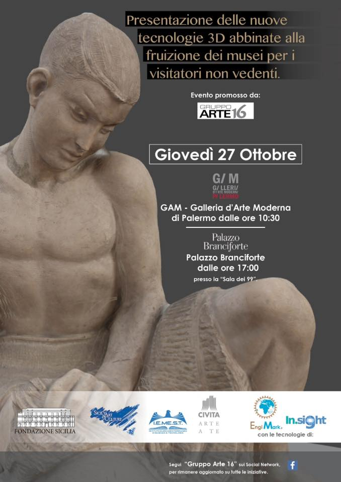
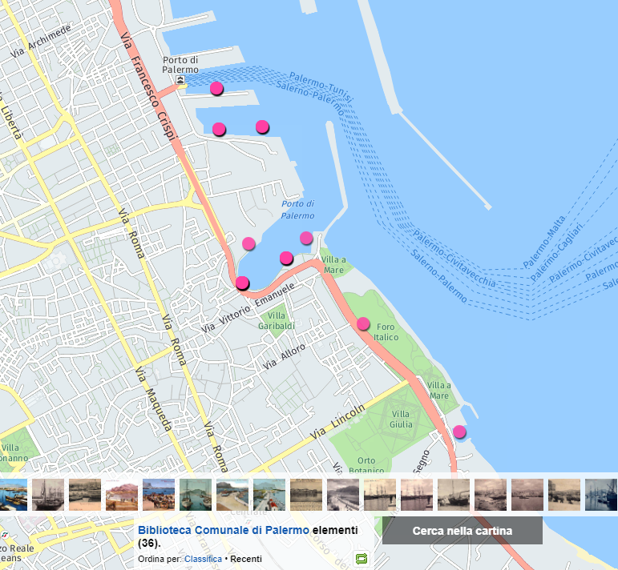

.. _h6350564f3356542ba314a27475d7c32:

Open data e innovazione tecnologica al comune di Palermo
########################################################

.. _h2c1d74277104e41780968148427e:

\ |STYLE0|\  

.. admonition:: email

    \ |LINK1|\ 

.. admonition:: licenza

    \ |IMG1|\  \ |LINK2|\ 

..  Hint:: 

    \ |STYLE1|\ 
    
    * Linee Guida nazionali versione 2013 per la gestione degli open data (AgID).
    
    * Linee Guida del comune di Palermo versione 2013 per la gestione degli open data.
    
    * Strategia regionale dell'Innovazione (Smart Specialisation Strategy) necessaria per l'attuazione del Programma Operativo FESR 2014-2020 Sicilia.
    
    * Vademecum nazionale ANCI per le città intelligenti.
    
    * #OPENFESR - Ideario per la condivisione del PO FESR 2014-2020 Sicilia. 
    
    * Linee Guida del Programma nazionale delle competenze, formazione e cultura digitale e idee per l'attuazione (AgID).
    
    * 3° Piano di Azione Open Government Partnership 2016 \ |LINK3|\ .
    
    * Linee Guida del comune di Palermo versione 2017 per la gestione degli open data.
    
    * Rilevazione spesa ICT del comune di Palermo per la partecipazione alla costruzione del Piano Triennale dell'Informatica nella Pubblica Amministrazione 2018-2020 (AgID).

.. _h2c1d74277104e41780968148427e:

.. _h2c1d74277104e41780968148427e:

.. _h803826771c663b1645486446c16613f:

2013
****

.. _h342e4e213b2860725c3775b6a2d5a70:

2013- linee guida nazionali open data
=====================================

Contributi per la costruzione delle "Linee Guida nazionali per la  valorizzazione del  patrimonio informativo pubblico" versione 2013 (AGID)

\ |LINK4|\  

\ |LINK5|\   LINEE GUIDA NAZIONALI PER LA VALORIZZAZIONE DEL PATRIMONIO INFORMATIVO PUBBLICO,  OPENDATA - SECONDO SEMESTRE 2013 - (Agenzia per l'Italia Digitale, che dipende da Presidenza Consiglio Ministri). Tra i ringraziamenti a pag. 8  il Comune di Palermo (solo Ciro Spataro ha inviato contributo via email) 

--------

.. _h56757d131c246d3a3111594f2211d49:

2013- opendataday 2013
======================

Organizzazione dei lavori - in collaborazione con il webmaster G. Meli e il consulente per l'ICT J. Marsh - finalizzati alla partecipazione del Comune di Palermo all'International Open Data Day del 23 febbraio 2013 

\ |LINK6|\ 

\ |LINK7|\  In occasione dell'International Open Data Day il webmaster del comune di Palermo ha attivato la sezione open data nel portale web istituzionale con i set di dati pervenuti da vari settori comunali

--------

.. _h2c6f5a3f50706a96e56676d474639d:

2013- linee guida open data comune Palermo
==========================================

Partecipazione attiva per la redazione partecipata delle "Linee Guida del Comune di Palermo per la gestione degli open data" 

\ |LINK8|\  le linee guida comunali per la gestione degli open data sono state presentate formalmente dal gruppo di lavoro opendata Palermo al Comune che le ha approvate con \ |LINK9|\  + \ |LINK10|\ 

(articolo \ |LINK11|\ )

--------

.. _h2694f6c1d2568287d4f151b56266660:

2013- vademecum per pa città intelligente
=========================================

Contributi per la definizione di metodi e strumenti di pianificazione e governance delle Smart Cities  

\ |LINK12|\  

\ |LINK13|\  VADEMECUM PER LA CITTA' INTELLIGENTE (OSSERVATORIO DELL'ANCI). Contributo personale riportato, come abstract, a pag.211 del vademecum 

--------

.. _h331d4d49297c2f1c4a62f4ffa4f3c:

2013- rilevazione fabbisogni innovazione
========================================

Redazione della manifestazione di interesse del Comune di Palermo (e invio telematico) nell'ambito del \ |LINK14|\  PER LA "RILEVAZIONE DEI FABBISOGNI DI INNOVAZIONE ALL'INTERNO DEL SETTORE PUBBLICO DELLE REGIONI CONVERGENZA".

Oggetto della manifestazione di interesse del Comune di Palermo: "Piattaforma online per l'ottimizzazione della gestione dei flussi di lavoro interni (innovazione di processo) e per il miglioramento dei servizi all'utenza, quali presupposti per l'attuazione concreta dell'Agenda Digitale del Comune di Palermo."

In attesa della valutazione del MISE.

--------

.. _h302ed123535335a166378304f3f7dd:

2013- focus regionale su innovazione sociale (smart specialization strategy)
============================================================================

Partecipazione al focus tematico sull'"innovazione sociale" della Regione Sicilia \ |LINK15|\  avviato per la costruzione della strategia regionale dell'innovazione necessaria per l'attuazione del PO FESR 2014-2020.

\ |LINK16|\  con il contributo sull'attività del Comune di Palermo avviata sugli open data, quale fattore utile a generare processi locali di innovazione sociale economica e ambientale.

--------

.. _h2c1d74277104e41780968148427e:

.. _h32182a493252554f293541d7b41445e:

2014
****

.. _hf7116581ffa672c16727a754821:

2014- Programma nazionale per la cultura, la formazione e le competenze digitali 
=================================================================================

Partecipazione alla redazione online del Programma nazionale per la cultura, la formazione e le competenze digitali (AGID)

(utenti più attivi = \ |LINK17|\ )

Partecipazione allo strumento online IDEARIO per la raccolta di idee per la cultura digitale, in attuazione del Programma nazionale per la cultura, la formazione e le competenze digitali (AGID) \ |LINK18|\  

.. _h20d70186274b59412b137422437757:

2014- formazione opendata dipendenti comunali
=============================================

Attività di assistenza costante al Responsabile Open Data del Comune di Palermo per l'attuazione delle linee guida comunali open data, in particolare con le prime attività del 2014 di:

* creazione del database dei referenti tecnici e tematici open data del Comune, come nominati dai dirigenti (su invito del Responsabile open data)  -> \ |LINK19|\  (documento in visione per gli account @comune.palermo.it)

* predisposizione del materiale didattico online per la formazione dei referenti open data comunali

* supporto tecnico ai referenti open data per l'attività di censimento delle banche dati da pubblicare sul portale open data 

--------

.. _h131e62703763524a3a141e506d267214:

2014- partecipazione a redazione linee guida nazionali open data
================================================================

Partecipazione alla redazione online delle Linee Guida per la Valorizzazione del Patrimonio informativo pubblico, open data, versione 2014 (AGID)

\ |LINK20|\  

--------

.. _h3d661c3d26c3b24723f4037246829:

2014- #openfesr per il PO FESR Sicilia 2014-20
==============================================

Partecipazione all'iniziativa #OPENFESR della Regione Sicilia, propedeutica alla condivisione del Programma Operativo FESR Sicilia 2014-2020 

\ |LINK21|\  

\ |LINK22|\   - \ |LINK23|\  (Pag. 22)

Contributi all'Obiettivo tematico 2  del PO FESR Sicilia 2014-2020 (Agenda Digitale): \ |LINK24|\  

Contributi all'Obiettivo tematico 11 del PO FESR Sicilia 2014-2020  (Rafforzare la capacità istituzionale delle autorità pubbliche e delle parti interessate e un’amministrazione pubblica efficiente): \ |LINK25|\  

--------

.. _h6d125b354837267b111719736262b71:

2014- Smart Specialisation Strategy Sicilia
===========================================

Partecipazione alla generazione di contributi per la costruzione della Strategia regionale dell'Innovazione della Sicilia (Smart Specialisation Strategy - RIS3) propedeutica all'attuazione del PO FESR Sicilia 2014-2020

\ |LINK26|\  

.. _h31c793c422117a43b3f6f762c524:

2014- analisi dei profili ICT 
==============================

Analisi dei profili ICT del framework europeo al fine di mappare le e-competenze del Comune di Palermo anche attraverso le figure professionali presenti presso l'Azienda partecipata Sispi SPA

\ |LINK27|\  

--------

.. _h4c7854796f7b2836665c3142417c3940:

2014- webinar cultura digitale
==============================

Diffusione, di concerto con il Responsabile open data, via email al personale dirigente e dipendente del Comune del \ |STYLE2|\  organizzato dal Formez PA nell’ambito delle attività formative legate al "Programma nazionale per la cultura, la formazione e le competenze digitali"

\ |LINK28|\  - \ |LINK29|\  - \ |LINK30|\  

\ |LINK31|\  

--------

.. _h2d23806a1d782a62e511d5245d2e:

2014- workshop open data giornata trasparenza Palermo
=====================================================

Cogestione del workshop pubblico open data nel contesto della 1° giornata della Trasparenza e Partecipazione del Comune di Palermo dell'8 luglio 2014

\ |LINK32|\  

Due report sono disponibili sul workshop open data: 

* \ |LINK33|\  a cura di Andrea Borruso

* \ |LINK34|\  a cura di Ciro Spataro

--------

.. _h3f2135563c6d1c316b92345749f3a:

2014- adesione Palermo ad app IO RICICLO
========================================

Adesione alla piattaforma digitale dell'applicazione per dispositivi mobili IO RICICLO finalizzata alla gestione informativa dei calendari sulla raccolta differenziata della città di Palermo. Avviati contatti con la software house Xtreme Software di Teramo per la personalizzazione della piattaforma di data entry per le particolari esigenze di raccolta differenziata del Comune di Palermo.

L'app (per sistemi Andorid e Ios) è disponibile gratuitamente per i cittadini e le aziende di Palermo per la visualizzazione dei calendari della raccolta differenziata, per la descrizione e ubicazione georeferenziata dei centri di raccolta dei rifiuti elettronici ed ingombranti e per i messaggi diretti che la società RAP intende inviare per particolari esigenze. Il servizio informativo dell'app è a costo zero per l'Amministrazione Comunale

download dell'app \ |LINK35|\  

comunicato stampa istituzionale di lancio dell'app \ |LINK36|\  

.. _h5638763e2f183614e364f3e1d721b2f:

2014- appfordummies
===================

Cogestione del workshop pubblico “APP4DUMMIES” del 23 luglio 2014 alla Fonderia Oretea, nell’ambito delle attività di dissemination del progetto UE “Citadel on the Move”  \ |LINK37|\ . Il workshop focalizza l’attenzione sull’utilità degli “Open data” e fa da laboratorio per sperimentare co-creazione e partecipazione ad esperienze pratiche sull’argomento. Nel format del workshop “Apps4Dummies”, si assistono i partecipanti (referenti interni open data) a creare la prima app in tempo reale utilizzando file excel e visualizzando dati nel territorio.

locandina e registrazione

\ |LINK38|\ 

report su innovatoripa.it: \ |LINK39|\  

report su opendatasicilia.it:

\ |LINK40|\  

.. _h55272739135f216de595b1e116e5514:

2014- formazione Formez su open data a referenti comunali Palermo
=================================================================

Condivisione (effettuata via email) del percorso formativo online del FORMEZ \ |LINK41|\  sugli open data, destinato a dipendenti pubblici delle 4 regioni meridionali obiettivo convergenza. 

Oltre 40 dipendenti comunali (referenti tecnici e tematici) hanno partecipato al percorso online e 70 dipendenti hanno partecipato alla giornata formativa del 2 dicembre 2014 alla Fonderia Oretea.

Condivisione (effettuata via email) con i referenti open data di \ |LINK42|\ . 

--------

.. _h4717212a7eb2c263e11d597543461f:

2014- partecipazione a bando MeetYoungCities
============================================

Partecipazione, insieme alla dott.ssa Angela Errore dell'Area Cittadinanza Sociale, al bando “\ |LINK43|\ : Social innovation e partecipazione per i giovani dei Comuni italiani". Un iniziativa nata da una collaborazione tra ANCI, IFEL e ANG-Agenzia Nazionale Giovani. 

Il Comune partecipa nel Novembre 2014 (con la \ |LINK44|\ ) al bando con l'iniziativa "spazi creativi di lavoro".

--------

.. _h652e16342587959173c3581c45d45:

2015
****

.. _h523d384a1a666d7f1d386f336d1e563d:

2015- riunioni periodiche con i referenti open data per la pubblicazione dataset
================================================================================

Riunioni  settimanali (obiettivi UO Innovazione) con i referenti open data dei vari uffici comunali al fine di: 1) rendere omogenea la conoscenza sugli open data (funzioni, vantaggi, pubblicazione), e utilizzare facilmente un linguaggio tecnico comune, e 2) identificare congiuntamente i dataset in formato aperto già disponibili nei vari uffici, da sottoporre a valutazione del titolare della banca dati (dirigente di Servizio o Capo Area) per la pubblicazione sul \ |LINK45|\ . 

--------

.. _h1e742f97f282087a4a6027385e59f:

2015- riunione Team open data Palermo
=====================================

Il 16 febbraio 2015 è stata organizzata la prima riunione del Team Open Data come previsto dalle \ |LINK46|\ . Partecipanti: Segretario Generale, Responsabile Trasparenza, Responsabile Open Data, Capi Area, Webmaster, Esperto Gis.  Il Segretario Generale ha sottolineato l'esigenza di effettuare degli incontri tra lo staff del responsabile Open Data (Dott.ssa Rimedio, Geom. Spataro, Dott. Meli) e i Capi Area dell'Amministrazione al fine di 1) rendere omogenea la conoscenza sugli open data (funzioni, vantaggi, pubblicazione), per utilizzare facilmente un linguaggio tecnico comune, e 2) identificare congiuntamente i dataset in formato aperto prioritari per la pubblicazione (secondo la metodologia MOSCOW descritta a pagine 8 nelle \ |LINK47|\ ).

--------

.. _h13a73695216105a633a463c2c59617c:

2015- opendataday 2015 Palermo
==============================

Partecipazione all'iniziativa mondiale dell'Open Data Day 2015 (21 febbraio) di Palermo \ |LINK48|\  

--------

.. _h7a6a4f4946b42591880153219682f6e:

2015- portale formazione open data 
===================================

A seguito della riunione del Team Open Data nel mese di febbraio 2015 ho costruito il portale web didattico/formativo sugli open data \ |LINK49|\  così da dare la possibilità a tutti i 140 referenti open data dell'Amministrazione, ma anche ai titolari delle banche dati (dirigenti) di fruire permanentemente di una formazione ad hoc nel momento in cui ogni singolo individuo ravvisa la necessità di approfondire la conoscenza nell'ambito dei dati in formato aperto. Un portale che oltre alla parte didattica formativa, riporta buone prassi da prendere come punto di riferimento operativo.

--------

.. _hf3a364b1b4541563544a19196537:

2015- webinar Formez su prevenzione della corruzione
====================================================

Febbraio. Condivisione via email  dell'informazione di 5 webinar sulla Prevenzione della Corruzione realizzati dal FormezPA nel mese di febbraio e di marzo.  

\ |LINK50|\ 

--------

.. _h5d5ce545133f261414e57140396a:

2015- webinar fatturazione elettronica
======================================

Febbraio. Condivisione via email del ciclo webinar dal titolo “\ |LINK51|\ " - 4 incontri dalle 11.30 alle 13.00 delle seguenti date:  12 marzo 2015  - 19 marzo 2015  - 26 marzo 2015  - 2 aprile 2015.

.. _h455b23266794a38273a41761793e51:

2015- Piani Informatizzazione comunali
======================================

Febbraio. Condivisione via email con la dott.ssa Vincenza Simonte (UO Gestione e Sviluppo Sistemi Informativi dell'Area Innovazione Tecnologica) di alcune bozze di Piano di Informatizzazione dei servizi comunali (ai sensi ex art. 24 DL 90/2014):

\ |LINK52|\ 

\ |LINK53|\ 

--------

.. _h197356c733a675933383f172a63126:

2015- proposta progetto UE open data OpenIt4Change
==================================================

Maggio 27. E' stata presentata dal capofila (Università di Belfast, Norther Ireland) alla Commissione Europea, nel contesto del programma Horizon2020 (call \ |LINK54|\ ), una proposta di progetto trasnazionale denominata "\ |STYLE3|\ " (oltre 10 partner europei tra enti pubblici, privati e di ricerca). L'obiettivo della proposta progettuale è la valorizzazione degli open data pubblicati dalle pubbliche amministrazioni, in termini di realizzazione di servizi online utili a tutti. La città di Palermo è stata inserita in questo partenariato trasnazionale come città pilota. Si è in attesa delle risultanze delle analisi da parte della  Commissione Europea. 

Ottobre 2015. Il partner coordinatore informa i partner periferici della non positiva valutazione della proposta progettuale da parte della Commissione EU.

--------

.. _h311f467354e4361615a5d4b57e1d1:

2015- evento diffusione software libero
=======================================

Maggio 12. Organizzazione dell'evento Libre Office Roadshow, \ |LINK55|\  di sensibilizzazione, diretto ai referenti open data per l'uso di sofware open source. Stimolo all'uso di formati aperti per la gestione dei dati nell'ambito del lavoro quotidiano.

--------

.. _h21a126c6b1844123a67231d355b1d2d:

2015- webinar dati personali e trasparenza
==========================================

Giugno.  Condivisione via email del webinar  "\ |STYLE4|\ ". \ |LINK56|\ .

--------

.. _h6095a4046537a2c1c182cc19124410:

2015- seminario per migliorare le competenze digitali nella Pubblica Amministrazione locale
===========================================================================================

Giugno 9. Collaborazione per l'organizzazione del Seminario per migliorare le competenze digitali nella Pubblica Amministrazione locale \ |LINK57|\ . Evento in collaborazione con il FormezPA e Stati Generali dell'Innovazione. All'evento hanno partecipato i referenti open data.

--------

.. _h12333f471996b1c246e4f4f7718653e:

2015- corso Formez online su e-leadership
=========================================

Ottobre-Novembre. Partecipazione al corso online del Formez sull'\ |LINK58|\ .

--------

.. _h63507764117e79585d4e584f3403b44:

2015- corso Formez su open data
===============================

Novembre. Partecipazione al corso online sugli open data del FormezPA \ |LINK59|\  

.. _h1e742f97f282087a4a6027385e59f:

2015- riunione Team open data Palermo
=====================================

Dicembre. \ |LINK60|\ .

--------

.. _h80710a454d571078253a502c42468:

2015- adesione a piattaforma nazionale PagoPA
=============================================

Dicembre.  Redazione, in collaborazione con il dott. Marchese e la dott.ssa Collura, della \ |LINK61|\  del Comune di Palermo al nodo dei pagamenti elettronici delle PA (approva Protocollo Intesa tra Comune Palermo e AGID).

Ricognizione, presso gli uffici comunali, delle tipologie dei pagamenti dovuti a vario titolo al Comune di Palermo, con il quale - attraverso modulo google - è stato prodotto relativo \ |LINK62|\ .

--------

.. _h6b192c68732379165b81d6a40e262e:

2016
****

.. _h2244705d670685a673f6c57453c1b5c:

2016- mappa della mobilità sostenibile di Palermo
=================================================

Gennaio. \ |LINK63|\ . 

--------

.. _h2e5b2f2b2164c6c357021f7a685430:

2016- opendataday 2016 Palermo
==============================

5 Marzo. Partecipazione alla giornata mondiale Opendataday in rappresentanza dell'Area Innovazione Tecnologica. \ |LINK64|\  

--------

.. _h7e804845667d296d6f336319227c3445:

2016- mappa Palermo accessibile
===============================

Marzo. Redazione della mappa della Palermo Accessibile ai portatori di disabilità: \ |LINK65|\  e \ |LINK66|\ . I lavori sono stati preparatori per \ |LINK67|\ .

--------

.. _h7e5318483f40f6b466b4c4174541e:

2016- mappa Anello Telematico comunale con uffici connessi
==========================================================

Marzo. Redazione della mappa georeferenziata informativa sulla struttura denominata \ |LINK68|\  (rete fibra ottica comunale) per la distribuzione della connettività ad alta velocità agli \ |LINK69|\ .

--------

.. _h711b2860404d3c11ac47727967155c:

2016- mappa Piano emergenza Protezione Civile Palermo
=====================================================

Marzo. Redazione della \ |LINK70|\ , sulla base degli \ |LINK71|\ . La mappa è disponibile per la pubblica visione nell'area "\ |LINK72|\ " del portale open data.

.. _h1255d322b7a611443186b27175179:

2016- Startup Weekend Tourism Edition
=====================================

Aprile. partecipazione come \ |LINK73|\  allo Startup Weekend Tourism Edition

Il comune di Palermo ha fornito il proprio supporto attraverso la figura di un mentor sugli open data (Ciro Spataro dell'Ufficio Innovazione) che ha presentato i dati del settore Turismo che l'Amministrazione pubblica nel portale Open Data. \ |LINK74|\  

--------

.. _h21533d747a7c45137164b44767e4d3b:

2016- opendataday e opencoesione
================================

Marzo 5. Partecipazione alla giornata mondiale opendataday svoltasi a Palermo (Noviziato dei Crociferi). Report dei lavori: 

\ |LINK75|\ .

--------

.. _h113538765be1a5442115a5417626d6c:

2016- riunione Team open data Palermo
=====================================

Giugno 1. Riunione del Team comunale Open Data e \ |LINK76|\ .

--------

.. _h7b5536203e83c49217380676cb4949:

2016- protocollo intesa con Istituto Einaudi per laboratorio open data
======================================================================

Giugno. Delibera GM 97 del 20.05.2016 di approvazione del \ |LINK77|\ .

\ |LINK78|\  tra IPS Einaudi, Comune di Palermo e community Opendatasicilia.

--------

.. _h4758787c357b3810101e651a6e74294c:

2016- adesione a wiki loves monuments Italia
============================================

Luglio. Lavori preparatori per l'\ |LINK79|\  all'iniziativa \ |LINK80|\ . \ |LINK81|\  aderenti all'iniziativa. \ |LINK82|\  aderenti all'iniziativa.

.. _h7e194d426e2102ef5317712494212:

2016- adesione a protocollo Anci-Polizia per Prevenzione crimini informatici
============================================================================

Luglio. Lavori preparatori per l'\ |LINK83|\  al \ |LINK84|\ . Presa d'atto dell'adesione del Comune avvenuta con \ |LINK85|\ .  \ |LINK86|\ . 

Deliberazione  inviata alla società partecipata SISPI SpA per porre in essere le azioni consequenziali.

--------

.. _h3156325136334049775b763452c3f9:

2016- partecipazione a redazione 3° Piano Azione Open Government Partnership
============================================================================

Agosto. Partecipazione online alla costruzione condivisa del \ |LINK87|\  

(OGP: iniziativa internazionale che mira a ottenere impegni concreti dai Governi in termini di promozione della trasparenza, di sostegno alla partecipazione civica, di lotta alla corruzione e di diffusione, dentro e fuori le Pubbliche Amministrazioni, di nuove tecnologie a sostegno dell’innovazione).

--------

.. _h7a30d42516729231a6d49632216749:

2016- adesione a proposta progettuale UE per public open data
=============================================================

Agosto. Collaborazione alla predisposizione della proposta progettuale in partenariato trasnazionale nell'ambito del programma UE CEF (Connecting Europe Facilities), da titolo "Toward a crossborder north south links for Opendata".  \ |STYLE5|\  \ |STYLE6|\  \ |STYLE7|\  \ |STYLE8|\  \ |STYLE9|\  \ |STYLE10|\  \ |STYLE11|\  \ |STYLE12|\  \ |STYLE13|\ . 

\ |LINK88|\ 

Partners: Provincia di Trento, Regione Emilia Romagna, Regione Friuli Venezia Giulia, Comune di Palermo, Stato di Slovenia, Fondazione Bruno Kessler, Stato di Malta.

Budget totale: 500.000 euro di cui circa 127.500 per Palermo. Finanziamento UE 50% e cofinanziamento partner in stipendi personale e capitoli di bilancio del partner partecipante coerenti con spese ICT/opendata.

Durata 24 mesi.

Entro il 15 settembre la Provincia di Trento sottopone la proposta progettuale telematicamente nel portale web EU per la valutazione.

News febbraio 2017: La proposta progettuale non è stata valutata positivamente dalla Commissione del Programma UE. Sarà riformulata in maniera rivista in occasione del Programma 2017 CEF e riproposta.

--------

.. _h2740741f47453e7f252c16263868515e:

2016- adesione a proposta progettuale UE per cyber security
===========================================================

Agosto. Collaborazione alla predisposizione della proposta progettuale Simpatico  \ |IMG2|\  in partenariato trasnazionale nell'ambito del programma UE Horizon 2020, dal titolo "Simpatico" (Security Implementation by Mentoring Public Administrations for Trustworthy Interactions and Cyber-safe Operativity) nell'ambito della sicurezza informatica nelle pubbliche amministrazioni e prevenzione del crimine informatico.

\ |LINK89|\ .

Se la proposta sarà ammessa dalla Commissione valutatrice a finanziamento, Palermo,  insieme ad altre PA partners, farà da pilota nella sperimentazione di un software elaborato nel progetto.

Budget per Palermo 127.875 euro. Finanziamento UE 100%.

Partners: 1 SOFTECO SISMAT (coordinator) (IT) - 2 MONTIMAGE EURL (FR) - 3 EUROHELP CONSULTING SL (ES) - 4 ALITER TECHNOLOGIES (SK) - 5 USTAV INFORMATIKY, SLOVENSKA AKADEMIA VIED (SK) -  

6 CONSIGLIO NAZIONALE DELLE RICERCHE (IT) - 7 THE UNIVERSITY COURT OF THE UNIVERSITY OF ABERDEEN (UK) - 8 AYUNTAMIENTO DE MADRID (with POLICIA MUNICIPAL MADRID) (ES) - 9 COMUNE DI GENOVA or GENOVA CITTÀ METROPOLITANA (IT) - 10 COMUNE DI PALERMO (IT).

Durata 36 mesi.

Entro il 25 agosto 2016 il partner tecnico Softeco sottometterà la candidatura della proposta progettuale nel portale europeo ECAS di Horizon2020 per la valutazione.

News gen_2017: la proposta non è stata valutata positivamente dalla Commissione UE.

--------

.. _h7f5b747e7d137c3c756c357247657d52:

2016- partecipazione a evento annuale opendatasicilia
=====================================================

Settembre. Partecipazione all’iniziativa di 3 giorni di \ |LINK90|\  a Messina dal 2 al 4 settembre 2016.  Un programma molto ricco di eventi sul mondo dei dati aperti a 360 gradi, con partecipanti esperti di open data provenienti da diverse parti d’Italia (guarda la \ |LINK91|\ ) e con una rappresentanza del portale europeo dei dati aperti \ |LINK92|\ . Report completo della 3 giorni: \ |LINK93|\  

\ |IMG3|\ 

--------

.. _h35b6b5e2d22382f29121b4168337943:

2016- partecipazione a evento Biggerdata al CNR Palermo
=======================================================

19 Ottobre. Partecipazione alla giornata conclusiva del progetto \ |LINK94|\  presso il CNR di Palermo con la presentazione dello stato dell’arte sugli open data del Comune di Palermo:

\ |LINK95|\  

--------

.. _h7b4e3b717d1783b21486d3384d373e:

2016- partecipazione a evento nuove tecnologie per la fruizione dei musei ai non vedenti
========================================================================================

\ |IMG4|\ 

27 Ottobre. Partecipazione alla giornata \ |LINK96|\   Organizzato da \ |LINK97|\  presso Palazzo Branciforte, con la presentazione sulle potenzialità degli open data comunali di Palermo sul turismo per la creazione di servizi rivolti ai portatori di diverse disabilità, inclusi gli ipovedenti (\ |LINK98|\ ).

\ |LINK99|\ .

.. _h53325d917f451932766d513750353f:

2016- deliberazione partnership con Istituto Einaudi-Pareto per partecipazione a bando MIUR
===========================================================================================

Novembre.  Predisposizione \ |LINK100|\  sui Curricoli Digitali.

.. _h31341f4e4b3a1d214b4a3c4b25607678:

2016- giornata trasparenza e open data comune Palermo
=====================================================

Dicembre 20. Partecipazione attiva alla \ |LINK101|\ . Organizzazione delle attività che hanno visto partecipare cittadini esponendo casi di riuso degli open data comunali finora pubblicati nel portale istituzionale.

Si è registrata una una costruttiva partecipazione civica di \ |LINK102|\ , \ |LINK103|\ , \ |LINK104|\  e di Salvatore Pullara (Polizia Municipale) e Girolamo Mimmo Renda (Polizia Municipale) sul riuso.

L'Amministrazione comunale con alcuni dei suoi Dirigenti Capo Area (Segretario Generale, Responsabile trasparenza, Responsabile open data e pubblicazione, Vice Capo di Gabinetto) hanno apprezzato gli interventi che hanno focalizzato l'attenzione sul riutilizzo degli opendata comunali per creare servizi informativi di vario tipo, con una concentrazione sui dati del trasporto pubblico urbano.

Patrizio Hausmann della comunità opendatasicilia è stato citato dai funzionari della Polizia Municipale come fonte per gli interessanti riusi dei dati per visualizzazione dei dati significativi sugli incidenti di veicoli in città. E' stata una interessante pagina di storia palermitana sulla partecipazione civica ai processi di pubblicazione di dati in formato aperto.

La presentazione di Daniele Mondello \ |LINK105|\ 

La presentazione di Ciro Spataro \ |LINK106|\ 

La presentazione della piattaforma della mobilità di Peppe Pace \ |LINK107|\ 

La presentazione della mappa degli incidenti e della rilevazione dell'inquinamento atmosferico dei funzionari della Polizia Municipale (Girolamo Renda e Salvatore Pullara) \ |LINK108|\ 

La presentazione di Andrea Borruso \ |LINK109|\ 

--------

.. _h113538765be1a5442115a5417626d6c:

2016- riunione Team open data Palermo
=====================================

Dicembre

Riunione del Team Open Data del Comune di Palermo il 21 dicembre, in ossequio alle Linee Guida comunali open data e redazione del \ |LINK110|\  

--------

.. _h3f6e6b306a694f5cd12075157b3b:

2016- partecipazione a evento invernale opendatasicilia
=======================================================

Dicembre. 28 dicembre partecipazione al raduno invernale dell'attiva comunità opendatasicilia a Castelbuono \ |LINK111|\   e condivisione dei risultati del \ |LINK112|\  del Team Open Data del Comune di Palermo.

--------

.. _h737818381f403a4c743113b633175f:

2017
****

.. _h5b487991d6f6a656645368507b366:

2017- database programmi Palermo per riqualificazione e innovazione
===================================================================

Gennaio. Redazione del \ |LINK113|\ .

--------

.. _h713b72325e16186e3972627c4b6f2826:

2017- linee guida comunali open data aggiornate a profilo DCAT_AP_IT
====================================================================

Gennaio. Adeguamento delle \ |LINK114|\  (approvate con Deliberazione di GM 252 del 13.2.2013) agli standard dell'AGID \ |LINK115|\  (2016) e alle \ |LINK116|\  (2016) per la valorizzazione del sistema informativo pubblico (AGID) e \ |LINK117|\  comunali.

--------

.. _hd7d173b78f6467d27b7d2c7c514a:

2017- Palermo capitale italiana giovani, lavori preparatori alla partecipazione della cittadinanza
==================================================================================================

Febbraio. Realizzazione dei moduli google per 1) la gestione dei dati di iscrizione delle Associazioni  ai tavoli tematici del'\ |LINK118|\ , concernenti la costruzione del percorso di Palermo Capitale italiana dei Giovani 2017 \ |LINK119|\  e 2) la raccolta dei dati sulla propositività delle stesse Associazioni relative all'anno 2017. 

Dalla compilazione di questo secondo modulo è stato possibile costruire \ |LINK120|\  di elevato valore per la ricchezza di dati dettagliati sulle attività svolte da oltre 300 Associazioni attive a Palermo nel campo della cultura, inclusione sociale, turismo e innovazione tecnologica. Su questo database si costruiranno - in condivisione con vari uffici comunali -  le reti di Associazioni con azioni omogenee da realizzare a Palermo a partire dal 2017.

E' stato prodotto il \ |LINK121|\  al quale ho partecipato l'8 febbraio 2017 in qualità di moderatore e relatore.

--------

.. _h657924797e3404a3b10407d2738245a:

2017- proposte open data sulla piattaforma di lavoro del Team nazionale trasformazione Digitale
===============================================================================================

20 Febbraio. Sulla piattaforma \ |LINK122|\  di lavoro dei comuni italiani pilota e del \ |LINK123|\  per l'attuazione dell'Agenda Digitale, al gruppo specifico \ |LINK124|\  (Data Analytics Framework) è stata presentata, da Palermo, la proposta operativa sugli open data, che è disponibile a questo link: \ |LINK125|\  

--------

.. _h9114a706f5266472d22256e7f2e80:

2017- proposta di Palermo per SPID nazionale
============================================

28 Febbraio. Sulla piattaforma \ |LINK126|\  di lavoro dei comuni italiani pilota e del \ |LINK127|\  per l'attuazione dell'Agenda Digitale, al gruppo specifico \ |LINK128|\  (Sistema Pubblico d'Identità Digitale) è stata presentata, da Palermo, la proposta per l'implementazione del sistema SPID, disponibile a questo link: \ |LINK129|\  

--------

.. _h1375297125375171424f451f5e752c5f:

2017- opendataday 2017 Palermo
==============================

\ |IMG5|\ 

4 marzo. Opendataday 2017 Palermo.

\ |LINK130|\  

Organizzazione e realizzazione dell'\ |LINK131|\  insieme ad ARCA incubatore d'imprese e alla comunità Opendatasicilia. \ |LINK132|\  e programma:

* 9.30: Saluti del Direttore Generale del Consorzio ARCA, a cura del dott. Fabio Maria Montagnino

* 9.35: Presentazione della politica Open Data comunale a cura dell’ing. Gianfranco Rizzo, Assessore all’Innovazione Tecnologica del Comune di Palermo

* 9.45: La strategia comunale di partecipazione degli Open Data, a cura del dott. Gabriele Marchese, Resp. Open Data Comune di Palermo

* 10.00: La bozza del nuovo portale Open Data comunale, a cura del Webmaster Dott. Giuseppe Meli

* 10.15: \ |LINK133|\ , a cura di Ciro Spataro

* 10.30: Gli Open Data della Polizia Municipale, a cura di Girolamo Renda

* 10.45: Vulnerabilità sismica degli edifici residenziali di Palermo: \ |LINK134|\ , a cura di Letizia Carbone e Giovan Battista Vitrano

* 11.05: A scuola di Opencoesione, a cura di Giulio Di Chiara + testimonianza studenti 2015/16

* 11.25: Pausa

* 11.40: ARCA: le start up che usano i dati, a cura del Dott. Fabio Montagnino

* 11.50: Smartearting e gli Open Data del Comune di Palermo, a cura di Giuseppe Russo Project Manager presso Informamuse srl

* 12.10: Università e Ricerca: iniziative e progetti in ambito Open Data, a cura di Davide Taibi ricercatore CNR – ITD

* 12.30: La mappatura dei servizi accessibili nelle strutture ricettive, a cura di Aurelio Buglino CEO Bookingbility

* 12.45: Open Data e Sanità, una miniera di opportunità, a cura di Daniele Mondello

* 13.00: Dibattito

* 13.30: Fine lavori

* 14.30: Workshop: Web scraping per tutti: introduzione al tema e guida all’uso di alcune tecniche e strumenti, a cura di Andrea Borruso

Un evento molto ricco di contenuti relativi ai lavori svolti sui dati. Personalmente ho colto il significato di un processo culturale sulla generazione e pubblicazione dei dati comunali in continua evoluzione, partito nel 2013, sempre con un open data day.

E' stata registrata un'attenzione molto alta di presenti agli interventi con interazioni al 90% di carattere costruttivo e propositivo.

Il Comune è stato rappresentato da referenti molto interattivi con aziende e comunità civica locale, ricettivo delle proposte formulate: coordinatore attività su Open Data di supporto al Capo Area responsabile comunale Open Data, il Webmaster con le novità sull'implementazione grafica e funzionale del portale open data e la Polizia Municipale con le costanti pubblicazioni di dati concernenti il  controllo del territorio.

Diverse le aziende presenti con lavoro svolto sui dati nel campo dell'accessibilità alle strutture turistiche ricettive e nl campo della sanità.

Il Centro Nazionale Ricerche ha illustrato l'iniziativa di un corso universitario alla Facoltà di Informatica che prevederà un modulo concentrato sugli open data, come anche una borsa di studio CNR sullo stesso argomento. 

In generale l'evento è stata caratterizzato da armonia e coesione tra i partecipanti.

Andrea Borruso, della community Opendatasicilia e Associazione OnData ha colto in ogni intervento quegli spunti utili a migliorare il processo di produzione-pubblicazione-uso dei dati, sia da parte della PA che dalla parte della comunità-aziende. Nel pomeriggio Andrea Borruso ha tenuto un evento formativo di 2 ore sull'utilità di effettuare web scraping la fine di ottenere dai siti i dati strutturati in formato tabellare.

--------

.. _h662e722b66655e3c6e7166347d15304c:

2017- lavori e incontri per Palermo capitale giovani
====================================================

\ |IMG6|\ 

4 aprile. Riunione del gruppo coordinatore dei lavori per Palermo Capitale Italiana dei Giovani 2017 \ |LINK135|\  per identificare step operativi successivi: 1) restituzione pubblica dei lavori dei tavoli tematici ai cantieri culturali della Zisa, 2) prosecuzione lavoro per la narrazione del processo culturale di Palermo Capitale Italiana dei Giovani 2017, 3) eventuali altri tavoli di approfondimento con le proposte operative presentate attraverso la compilazione del modulo google, distinte per ambito tematico.

Riunioni del tavolo tecnico Innovazione Tecnologica il 19 aprile e il 3 maggio 2017. Il processo di coinvolgimento e partecipazione a Capitale italiana Giovani 2017 è descritto minuziosamente in questo \ |LINK136|\ .

--------

.. _h143f3e452d292c2a70466f5f44b44:

2017- avvio piattaforma pagamenti elettronici alle PA, PAgoPA
=============================================================

Aprile. E' stata resa disponibile - dalla Società SISPI SpA - la pagina dei pagamenti elettronici del comune di Palermo \ |LINK137|\  attraverso l'adesione del Comune al sistema nazionale \ |LINK138|\ , istituito dall'AgID. La deliberazione di GM di adesione comunale al sistema nazionale PagoPA era stata redatta e approvata nel dicembre 2015.

Ad aprile 2017 è possibile  effettuare 2 pagamenti elettronici al Comune di Palermo

\ |IMG7|\ 

.. _h447311455373f6940203a772779277:

2017- delibera approvazione linee guida comunali aggiornate a profilo DCAT_AP_IT
================================================================================

Maggio. Redazione della deliberazione di GM (n. 97/2017) di approvazione delle Linee guida comunali open data, versione 2017 partecipate. La nuova versione di linee guida deriva dall'integrazione delle linee guida comunali open data del 2013 con il \ |LINK139|\  (profilo nazionale dei metadati) e con le l\ |LINK140|\  dell'AgID del 2016. Altresì le linee guida comunali di Palermo versione 2017 partecipata, derivano da un processo di partecipazione, essendo state (le stesse linee guida) \ |LINK141|\ .

--------

.. _h195096a4d6846104f2d562235592d:

2017- protocollo intesa con Associazione Comuni Trentini per riuso software OpenAgenda
======================================================================================

Settembre. Redazione della proposta di Deliberazione (approvata DG. N. 172 DEL 21/09/2017) di approvazione del PROTOCOLLO D'INTESA TRA COMUNE DI PALERMO E CONSORZIO DEI COMUNI TRENTINI SOCIETA' COOPERATIVA PER IL RIUSO GRATUITO DEI MICROSERVIZI DELLA PIATTAFORMA \ |LINK142|\ . Uno dei microservizi di prima utilità per il comune di Palermo è rappresentato da \ |LINK143|\ , con possibilità di rilascio automatico di open data degli eventi stessi e delle Associazioni che popolano la piattaforma di dati.

--------

.. _h19356c6a35535a7d282374708ea:

2017- Hackdevelopers 
=====================

\ |IMG8|\ 

7-8 Ottobre. Hack.developers

Partecipazione all'evento in qualità di referente comunale.  

\ |LINK144|\  

Tutte le tech community italiane e gli sviluppatori hanno partecipato alla maratona di programmazione organizzata in contemporanea in oltre 20 città su tutto il territorio nazionale! Hack.Developers, promosso dal Team per la Trasformazione Digitale in collaborazione con Codemotion, è stato il più grande hackathon mai realizzato in Italia! I progetti su cui hanno lavorato i partecipanti sono: SPID - Sistema Pubblico d'Identità Digitale, ANPR - Anagrafe Nazionale della Popolazione Residente, DAF - Data & Analitycs Framework, DAF - Dataportal, DAT - Dati Pubblici (nuovo Dati Gov.it), Security, Design.

--------

.. _h6152777a43223e1755257b162c362d:

2017- lavori per pubblicazioni foto Biblioteca comunale sulla piattaforma Flickr
================================================================================

Ottobre. Nell'ambito delle attività legate alla valorizzazione del patrimonio informativo comunale, è stato costruito, insieme al gruppo di lavoro "Promozione e Comunicazione" della Biblioteca Comunale di Palermo, il profilo Flickr \ |LINK145|\  per la pubblicazione del patrimonio storico già digitalizzato.

Sono stati avviati i caricamenti delle foto scegliendo la licenza CC BY SA prevista dalle linee guida comunali open data.

Questa iniziativa rappresenta un importante passo dell'Amministrazione che consentirà di visualizzare online interessanti contenuti della Biblioteca, utili per studenti, turisti, storici.

L'accesso ai dati, tramite le API di Flickr, è assicurato dai seguenti link:

* \ |LINK146|\ 

* \ |LINK147|\ 

* \ |LINK148|\  

* \ |LINK149|\  

Infine è possibile visualizzare la mappa georeferenziata dei contenuti pubblicati attraverso il servizio reso disponibile da Flickr: \ |LINK150|\  

\ |IMG9|\ 

--------

.. _h5b586d1343b2810542c3a423a7e6c62:

2017- Implementazione Misure minime ICT da Piano Triennale Informatica nella PA
===============================================================================

Dicembre. In collaborazione con Capo Area Innovazione Tecnologica, Responsabile Transizione al Digitale (art. 17 CAD) e con staff Società Sispi è stato redatto e inviato via PEC all’AGID pochi giorni prima di Natale il \ |LINK151|\ .

--------

.. _h38661f50315e747a1d425a5760796f3d:

2017- harvesting del catalogo dataset comune Palermo su portale nazionale dati.gov.it
=====================================================================================

Dicembre. In collaborazione con lo staff del Webmaster e con il dott. Davide Taibi del CNR di Palermo e con la dott.ssa Giorgia Lodi dell'AgID è stato possibile effettuare 1) l'adeguamento dei metadati del catalogo dei dataset comunali al profilo DCAT_AP_IT dell'AgID, 2) l'harvesting dei metadati del catalogo dei dataset comunali nel portale dati.gov.it

Contemporaneamente lo staff del webmaster ha rilasciato la nuova versione del portale opendata \ |LINK152|\  compliant con il profilo DCAT_AP_IT.

--------

.. _h6045705a2153546f7567786a451696f:

2017- rispettate le scandenze del Piano Triennale ICT nella PA per il 2017
==========================================================================

Dicembre. Sono state rispettate dal comune di Palermo le 5 scadenze del CAD per fine 2017.

\ |IMG10|\ 

(infografica da \ |LINK153|\ ) 

\ |STYLE14|\  Confermata con Deliberazione di G.M. 185 del 10.10.2017.

\ |STYLE15|\  E' stata inviata PEC all’AGID pochi giorni prima di Natale con allegato firmato digitalmente il “Modello Implementazione” delle misure minime sicurezza ICT.

\ |STYLE16|\  A dicembre 2015 è stata approvata la delibera di adesione del comune di Palermo al sistema dei pagamenti PagoPA e nel 2017 sono stati già attivati due pagamenti https://www.comune.palermo.it/pago-pa.php. Altri pagamenti sono già in preparazione, da attivare nella prima metà 2018.

\ |STYLE17|\  Già attiva l’autenticazione con SPID per gli operatori del portale tematico dell’\ |LINK154|\ .

\ |STYLE18|\  I dataset open data comunali sono esposti con metadatazione ai sensi del profilo DCAT_AP_IT previsto dal Piano Triennale ICT della PA e procedure di harvesting già effettuate con la collaborazione dell’AGID.

Un post dettagliato (con i riferimenti alle persone che ci hanno lavorato): \ |LINK155|\  

--------

.. _h7c23534126f3d5c721d737044187276:

2018
****

.. _h4b2e29801901a3f385e21f3831e7b:

2018- lavori per l'adozione del software dei comuni Trentini OpenAgenda per la gestione e pubblicazione degli eventi culturali
==============================================================================================================================

24 Gennaio. Videoconferenza con la Società SISPI e la Società informatica OpenContent dell'Associazione dei comuni trentini, per la verifica dell'adozione da parte dell'Amministrazione comunale del software OpenAgenda per le finalità di comunicazione degli eventi culturali di Palermo in occasione di Palermo capitale italiana della cultura 2018. Durante la video conferenza sono stati illustrate le peculiarità e funzionalità di OpenAgenda. La Società SISPI ha valutato positivamente tali funzionalità e si è iniziato un confronto per la verifica delle questioni puramente tecniche propedeutiche al riuso del software.

--------

.. _h225b3c1d457b56325a121f67e68672:

2018- partecipazione a riunione nazionale AGID per rilevazione spesa ICT nella PA
=================================================================================

25 Gennaio. Partecipazione, insieme al Dirigente del Servizio Innovazione dott. Gabriele Marchese, alla riunione dell'Agenzia per l'Italia Digitale presso la Sala Polifunzionale della Presidenza del Consiglio dei Ministri, a Roma, il 25 gennaio, per conoscere le modalità operative di inserimento, nella piattaforma AGID, dei dati di spesa ICT sostenuti dalle PA pilota italiane (Città Metropolitane e Comuni capoluogo). I dati serviranno all'AGID per costruire il Piano Triennale per l'Informatica nella Pubblica Amministrazione 2018-2020. Il termine di scadenza per l'inserimento dei dati è il 2 marzo 2018.

--------

.. _h4d6f7d1c566c1e578e4da46147533:

2018- attivazione SPID
======================

20 febbraio: \ |LINK156|\  per l'accesso dei cittadini ai servizi digitali del comune di Palermo, grazie alla Società SISPI SpA.  \ |LINK157|\ .

--------

.. _h754448375910422d163243118394579:

2018- adozione piattaforma DocsItalia su Read the Docs per pubblicazione documenti del comune di Palermo
========================================================================================================

Marzo.  L'Agenzia per l'Italia Digitale in collaborazione con il Team Trasformazione Digitale ha reso disponibile il servizio \ |LINK158|\  per le Pubbliche Amministrazioni al fine di far pubblicare documenti tecnici e amministrativi su una piattaforma che offre ai cittadini la possibilità di leggere e commentare documenti pubblici ed essere informati sull’andamento dei progetti. 

\ |STYLE19|\  vuole diventare, per l'AGID, il luogo che offre una visione di insieme sui progetti pubblici in corso, affiancando gli aspetti tecnologici e quelli amministrativi. Docs Italia utilizza il version control system di GitHub e mette a disposizione un sistema che consente di tenere traccia della storia di un documento e mantenerne tutte le versioni, permettendo di confrontarle fra loro. I documenti di Docs Italia hanno un indice ben strutturato, un motore di ricerca efficace e sono di facile lettura, anche sullo smartphone.

Per il \ |LINK159|\ :

* \ |LINK160|\ 

* \ |LINK161|\ 

* \ |LINK162|\ 

* \ |LINK163|\ 

* \ |LINK164|\ 

* \ |LINK165|\ 

* \ |LINK166|\ 

* \ |LINK167|\ 

* \ |LINK168|\ 

--------

.. _h1e7fb754645a2f3d206616522655c:

2018- invio compilazione questionario online su rilevazione spesa ICT ad AGID
=============================================================================

19 marzo. Invio all'AGID del \ |LINK169|\  del Comune di Palermo. I dati rilevati servono all'AGID per la costruzione del \ |LINK170|\  2018-2020.

--------

.. _h1f151165765b53be42297c63607174:

2018- infoday ai Dirigenti su CAD e servizi digitali 
=====================================================

4-5-6 aprile. Infoday sul Codice dell'Amministrazione Digitale e sui servizi digitali del comune di Palermo, indirizzata ai Dirigenti comunali.

Materiali informativi: \ |LINK171|\  

--------

.. bottom of content

.. |STYLE0| replace:: **Contributi di Ciro Spataro nei processi di innovazione al comune di Palermo, per il miglioramento delle competenze digitali dei dipendenti, per l'attuazione delle linee guida open data**

.. |STYLE1| replace:: **Contributo ai principali strumenti di innovazione comunali, regionali e nazionali:**

.. |STYLE2| replace:: **ciclo di webinar su Cultura digitale**

.. |STYLE3| replace:: **OpenIt4Change**

.. |STYLE4| replace:: *Come si muovono le pubbliche amministrazioni tra la domanda di trasparenza e la necessità di protezione dei dati personali?*

.. |STYLE5| replace:: *The proposed action is to support the establishment of an*

.. |STYLE6| replace:: **standardized cross-border community**

.. |STYLE7| replace:: *(Italy, Slovenia, Malta) in order*

.. |STYLE8| replace:: **to support a multi-level governance (national/regional/city/local) alignment of local opendata initiatives to the EDP**

.. |STYLE9| replace:: *platform and*

.. |STYLE10| replace:: **foster the adoption of common standards**

.. |STYLE11| replace:: *and*

.. |STYLE12| replace:: **common practices**

.. |STYLE13| replace:: *for the enhancement of Public Sector Information (on quality/interoperability/monitoring/evaluation)*

.. |STYLE14| replace:: **Nomina Responsabile Transizione al Digitale.**

.. |STYLE15| replace:: **Sicurezza Informatica.**

.. |STYLE16| replace:: **Pagamenti informatici PagoPA.**

.. |STYLE17| replace:: **SPID Sistema Pubblico di Identità Digitale.**

.. |STYLE18| replace:: **Esposizione dei metadati delle banche dati in formato aperto conformi al profilo (DCAT_AP_IT).**

.. |STYLE19| replace:: **Docs Italia**

.. |LINK1| raw:: html

    <a href="mailto:c.spataro@comune.palermo.it">c.spataro@comune.palermo.it</a>

.. |LINK2| raw:: html

    <a href="https://creativecommons.org/licenses/by-sa/4.0/" target="_blank">questo documento è rilasciato con licenza CC BY SA 4.0</a>

.. |LINK3| raw:: html

    <a href="HTTP://OPEN.GOV.IT" target="_blank">http://open.gov.it</a>

.. |LINK4| raw:: html

    <a href="https://docs.google.com/document/d/1UiIyefu9XjvokDcGP8M6tG1UX4wPZ65P-5fsi00dx1k/edit" target="_blank">docs.google.com/document/d/1UiIyefu9XjvokDcGP8M6tG1UX4wPZ65P-5fsi00dx1k/edit</a>

.. |LINK5| raw:: html

    <a href="http://www.digitpa.gov.it/sites/default/files/allegati_tec/LG_Val_PSI_v1.0.pdf" target="_blank">www.digitpa.gov.it/sites/default/files/allegati_tec/LG_Val_PSI_v1.0.pdf</a>

.. |LINK6| raw:: html

    <a href="http://opendataday.it/palermo/" target="_blank">http://opendataday.it/palermo/</a>

.. |LINK7| raw:: html

    <a href="http://www.comune.palermo.it/noticext.php?id=1344" target="_blank">http://www.comune.palermo.it/noticext.php?id=1344</a>

.. |LINK8| raw:: html

    <a href="http://www.comune.palermo.it/noticext.php?id=2827" target="_blank">www.comune.palermo.it/noticext.php?id=2827</a>

.. |LINK9| raw:: html

    <a href="http://www.comune.palermo.it/js/server/normative/_13122013090000.pdf" target="_blank">Deliberazione di Giunta n. 252 del 13.12.2013</a>

.. |LINK10| raw:: html

    <a href="http://www.flipsnack.com/5CFF866BDC9/fdclv3l5" target="_blank">http://www.flipsnack.com/5CFF866BDC9/fdclv3l5</a>

.. |LINK11| raw:: html

    <a href="http://www.rosalio.it/2013/10/16/che-cosa-sono-gli-open-data-e-perche-sono-importanti/" target="_blank">www.rosalio.it/2013/10/16/che-cosa-sono-gli-open-data-e-perche-sono-importanti</a>

.. |LINK12| raw:: html

    <a href="https://app.box.com/s/oh35o7sk9jyvjmfd50xb" target="_blank">https://app.box.com/s/oh35o7sk9jyvjmfd50xb</a>

.. |LINK13| raw:: html

    <a href="http://osservatoriosmartcity.it/wp-content/uploads/Vademecum_def_2_light.pdf" target="_blank">http://osservatoriosmartcity.it/wp-content/uploads/Vademecum_def_2_light.pdf</a>

.. |LINK14| raw:: html

    <a href="http://attiministeriali.miur.it/anno-2013/marzo/di-13032013.aspx" target="_blank">BANDO INTERMINISTERIALE MISE/MIUR N.437 DEL 13 MARZO 2013</a>

.. |LINK15| raw:: html

    <a href="http://www.innovatoripa.it/strategia-innovazione-sicilia/discussione/focus-tematico-innovazione-sociale" target="_blank">www.innovatoripa.it/strategia-innovazione-sicilia/discussione/focus-tematico-innovazione-sociale</a>

.. |LINK16| raw:: html

    <a href="http://www.slideshare.net/innosicilia/10-spataro-ciroopendatasociety" target="_blank">www.slideshare.net/innosicilia/10-spataro-ciroopendatasociety</a>

.. |LINK17| raw:: html

    <a href="http://commenta.formez.it/ch/PianoCulturaDigitale/admin?id=0&t=users" target="_blank">http://commenta.formez.it/ch/PianoCulturaDigitale/admin?id=0&t=users</a>

.. |LINK18| raw:: html

    <a href="http://ideario.formez.it/content/usare-semplici-strumenti-di-cloud-x-sviluppare-il-senso-del-lavoro-condiviso-rete" target="_blank">http://ideario.formez.it/content/usare-semplici-strumenti-di-cloud-x-sviluppare-il-senso-del-lavoro-condiviso-rete</a>

.. |LINK19| raw:: html

    <a href="https://docs.google.com/spreadsheets/d/1Tao1dny6BXvxldMal9uKOVrQ3yHogZseoBMYb_fXyAA/edit#gid=0" target="_blank">https://docs.google.com/spreadsheets/d/1Tao1dny6BXvxldMal9uKOVrQ3yHogZseoBMYb_fXyAA/edit#gid=0</a>

.. |LINK20| raw:: html

    <a href="http://pubwiki.agid.gov.it/index.php?title=Discussione:Linee_Guida_Community_Editing&oldid=158" target="_blank">http://pubwiki.agid.gov.it/index.php?title=Discussione:Linee_Guida_Community_Editing&oldid=158</a>

.. |LINK21| raw:: html

    <a href="http://ideario.formez.it/content/rendere-luso-degli-opendata-il-motore-di-nuovi-servizi-e-di-nuova-economia-sicilia" target="_blank">http://ideario.formez.it/content/rendere-luso-degli-opendata-il-motore-di-nuovi-servizi-e-di-nuova-economia-sicilia</a>

.. |LINK22| raw:: html

    <a href="http://www.euroinfosicilia.it/programmazione-20142020/open-fesr-percorso-di-consultazione-pubblica-online/" target="_blank">http://www.euroinfosicilia.it/programmazione-20142020/open-fesr-percorso-di-consultazione-pubblica-online/</a>

.. |LINK23| raw:: html

    <a href="http://www.euroinfosicilia.it/?attachment_id=132649" target="_blank">OpenFesr_Report_Finale_Ideario</a>

.. |LINK24| raw:: html

    <a href="http://commenta.formez.it/ch/openfesr/?id_speech=82" target="_blank">http://commenta.formez.it/ch/openfesr/?id_speech=82</a>

.. |LINK25| raw:: html

    <a href="http://commenta.formez.it/ch/openfesr/?id_speech=91" target="_blank">http://commenta.formez.it/ch/openfesr/?id_speech=91</a>

.. |LINK26| raw:: html

    <a href="http://www.innovatoripa.it/strategia-innovazione-sicilia/discussione/tavolo-tematico-smart-cities-communities#comment-25413" target="_blank">http://www.innovatoripa.it/strategia-innovazione-sicilia/discussione/tavolo-tematico-smart-cities-communities#comment-25413</a>

.. |LINK27| raw:: html

    <a href="https://docs.google.com/document/d/10dQnvDwvb1fiHkfoWSYeA1vLVeJjqivAREcP6vokTeo/edit" target="_blank">https://docs.google.com/document/d/10dQnvDwvb1fiHkfoWSYeA1vLVeJjqivAREcP6vokTeo/edit</a>

.. |LINK28| raw:: html

    <a href="http://eventipa.formez.it/node/22587" target="_blank">12/06/2014: La cittadinanza digitale</a>

.. |LINK29| raw:: html

    <a href="http://eventipa.formez.it/node/23356" target="_blank">19/06/2014: Le nuove professioni digitali - 26/06/2014: La e-leadership</a>

.. |LINK30| raw:: html

    <a href="http://eventipa.formez.it/node/24145" target="_blank">03/07/2014: Competenze digitali per la PA - 17/07/2014: L'inclusione digitale</a>

.. |LINK31| raw:: html

    <a href="http://www.innovatoripa.it/posts/2014/06/5360/al-il-12-giugno-il-ciclo-di-webinar-su-cultura-digitale" target="_blank">http://www.innovatoripa.it/posts/2014/06/5360/al-il-12-giugno-il-ciclo-di-webinar-su-cultura-digitale</a>

.. |LINK32| raw:: html

    <a href="http://www.comune.palermo.it/noticext.php?id=4378" target="_blank">http://www.comune.palermo.it/noticext.php?id=4378</a>

.. |LINK33| raw:: html

    <a href="http://opendatasicilia.it/2014/07/14/prima-giornata-della-trasparenza-e-della-partecipazione-del-comune-di-palermo/" target="_blank">http://opendatasicilia.it/2014/07/14/prima-giornata-della-trasparenza-e-della-partecipazione-del-comune-di-palermo/</a>

.. |LINK34| raw:: html

    <a href="http://www.rosalio.it/2014/07/09/partecipazione-e-trasparenza-a-palermo-larte-del-non-fare/#comment-1349703" target="_blank">http://www.rosalio.it/2014/07/09/partecipazione-e-trasparenza-a-palermo-larte-del-non-fare/#comment-1349703</a>

.. |LINK35| raw:: html

    <a href="https://play.google.com/store/apps/details?id=it.xtremesoftware.ioriciclo&hl=it" target="_blank">https://play.google.com/store/apps/details?id=it.xtremesoftware.ioriciclo&hl=it</a>

.. |LINK36| raw:: html

    <a href="http://www.comune.palermo.it/noticext.php?id=4578" target="_blank">http://www.comune.palermo.it/noticext.php?id=4578</a>

.. |LINK37| raw:: html

    <a href="http://www.citadelonthemove.eu/" target="_blank">www.citadelonthemove.eu</a>

.. |LINK38| raw:: html

    <a href="https://docs.google.com/document/d/1sIjTcHqQM6Epu5ZpbEDSVKqeiKywp3uQ7CKLk3zTcbw/edit" target="_blank">https://docs.google.com/document/d/1sIjTcHqQM6Epu5ZpbEDSVKqeiKywp3uQ7CKLk3zTcbw/edit</a>

.. |LINK39| raw:: html

    <a href="http://www.innovatoripa.it/posts/2014/07/5818/app4dummies-di-opendata-ne-capiscono-pi%C3%B9-di-quanto-immaginassi" target="_blank">http://www.innovatoripa.it/posts/2014/07/5818/app4dummies-di-opendata-ne-capiscono-pi%C3%B9-di-quanto-immaginassi</a>

.. |LINK40| raw:: html

    <a href="http://opendatasicilia.it/2014/07/28/app4dummies-opendata-per-allinizio-come-andata/" target="_blank">http://opendatasicilia.it/2014/07/28/app4dummies-opendata-per-allinizio-come-andata/</a>

.. |LINK41| raw:: html

    <a href="http://eventipa.formez.it/node/29227" target="_blank">http://eventipa.formez.it/node/29227</a>

.. |LINK42| raw:: html

    <a href="https://sites.google.com/site/opendatapalermo/home/materiali-didattici" target="_blank">video tutorial sugli open data</a>

.. |LINK43| raw:: html

    <a href="http://osservatoriosmartcity.it/meetyoungcities-lavviso-pubblico-progetti-di-innovazione-sociale-nei-comuni-dellosservatorio-nazionale-anci-smart-city/" target="_blank">MeetYoungCities</a>

.. |LINK44| raw:: html

    <a href="https://drive.google.com/file/d/0B9q5qob_W3NiNHVldERwVmxNXzA/view?usp=sharing" target="_blank">Deliberazione di GM 208 del 28.11.2014</a>

.. |LINK45| raw:: html

    <a href="https://opendata.comune.palermo.it/opendata.php" target="_blank">portale istituzionale online sugli open data</a>

.. |LINK46| raw:: html

    <a href="http://www.comune.palermo.it/js/server/normative/_13122013090000.pdf" target="_blank">Linee Guida comunali</a>

.. |LINK47| raw:: html

    <a href="http://www.comune.palermo.it/js/server/normative/_13122013090000.pdf" target="_blank">Linee Guida comunali sugli open data</a>

.. |LINK48| raw:: html

    <a href="http://opendatasicilia.it/2015/02/23/la-pragmaticita-scena-oddit15/" target="_blank">http://opendatasicilia.it/2015/02/23/la-pragmaticita-scena-oddit15/</a>

.. |LINK49| raw:: html

    <a href="https://sites.google.com/site/opendatapalermo/" target="_blank">https://sites.google.com/site/opendatapalermo/</a>

.. |LINK50| raw:: html

    <a href="http://saperi.forumpa.it/story/104376/prevenire-la-corruzione-nella-pa-dal-12-febbraio-terzo-ciclo-di-webinar" target="_blank">http://saperi.forumpa.it/story/104376/prevenire-la-corruzione-nella-pa-dal-12-febbraio-terzo-ciclo-di-webinar</a>

.. |LINK51| raw:: html

    <a href="http://www.agendadigitale.regione.lombardia.it/cs/Satellite?c=Page&childpagename=DG_01%2FMILayout&cid=1213474652963&packedargs=TemplateDestinazione%3DMIRedazionaleDettaglio2Col%26assetid%3D1213716503443%26assettype%3DRedazionale_P&pagename=DG_01Wrapper" target="_blank">Fatturazione elettronica e ulteriori adempimenti normativi ad elevato impatto per gli EE.LL.</a>

.. |LINK52| raw:: html

    <a href="http://www.entionline.it/j17/SEGR/Delibera_G.C._-_Piano_di_informatizzazione.pdf" target="_blank">http://www.entionline.it/j17/SEGR/Delibera_G.C._-_Piano_di_informatizzazione.pdf</a>

.. |LINK53| raw:: html

    <a href="http://autonomielocali.regione.fvg.it/aall/opencms/AALL/SIAL/Piano_informatizzazione_ex_art_24_dl_90/index.html" target="_blank">http://autonomielocali.regione.fvg.it/aall/opencms/AALL/SIAL/Piano_informatizzazione_ex_art_24_dl_90/index.html</a>

.. |LINK54| raw:: html

    <a href="http://ec.europa.eu/research/participants/portal/desktop/en/opportunities/h2020/calls/h2020-euro-6-2015.html#tab2" target="_blank">H2020-EURO-6-2015</a>

.. |LINK55| raw:: html

    <a href="http://libreoffice-roadshow.it/" target="_blank">http://libreoffice-roadshow.it/</a>

.. |LINK56| raw:: html

    <a href="http://eventipa.formez.it/node/48879" target="_blank">http://eventipa.formez.it/node/48879</a>

.. |LINK57| raw:: html

    <a href="http://eventipa.formez.it/node/49185" target="_blank">http://eventipa.formez.it/node/49185</a>

.. |LINK58| raw:: html

    <a href="http://eventipa.formez.it/node/57584" target="_blank">e-leadership</a>

.. |LINK59| raw:: html

    <a href="http://eventipa.formez.it/node/57587" target="_blank">http://eventipa.formez.it/node/57587</a>

.. |LINK60| raw:: html

    <a href="http://www.comune.palermo.it/js/server/uploads/opendata/VerbaleriunioneTeamOpenDataComunePalermo11dic2015.pdf" target="_blank">Redazione del Verbale della 2° riunione del Team Open Data 2015</a>

.. |LINK61| raw:: html

    <a href="https://drive.google.com/file/d/0B9q5qob_W3NiU2dKbVBteE5NRTQ/view?usp=sharing" target="_blank">Delibera Adesione</a>

.. |LINK62| raw:: html

    <a href="https://docs.google.com/spreadsheets/d/1FpWZFXiIm0kE0iJ3gZL8nACdG-pKkqCQra_eTOEL_x0" target="_blank">database</a>

.. |LINK63| raw:: html

    <a href="http://umap.openstreetmap.fr/it/map/palermo-mobilita-sostenibile-2016_64782" target="_blank">Redazione della mappa della mobilità sostenibile di Palermo dal 2016</a>

.. |LINK64| raw:: html

    <a href="https://medium.com/@cirospat/opendataday-2016-palermo-una-giovane-storia-di-dati-9cbfecda3ab2#.b9f5aujl4" target="_blank">https://medium.com/@cirospat/opendataday-2016-palermo-una-giovane-storia-di-dati-9cbfecda3ab2#.b9f5aujl4</a>

.. |LINK65| raw:: html

    <a href="http://umap.openstreetmap.fr/it/map/palermo-accessibile_76608" target="_blank">1</a>

.. |LINK66| raw:: html

    <a href="http://umap.openstreetmap.fr/it/map/accessibilita-ai-disabili-dei-siti-a-palermo_78549" target="_blank">2</a>

.. |LINK67| raw:: html

    <a href="https://turismo.comune.palermo.it/turismo-accessibile.php" target="_blank">la mappa istituzionale sul portale web del turismo</a>

.. |LINK68| raw:: html

    <a href="http://umap.openstreetmap.fr/it/map/at-palermo_71124" target="_blank">ANELLO TELEMATICO</a>

.. |LINK69| raw:: html

    <a href="http://umap.openstreetmap.fr/it/map/palermo-uffici-comunali_32944" target="_blank">uffici comunali (mappa)</a>

.. |LINK70| raw:: html

    <a href="http://umap.openstreetmap.fr/it/map/piano-protezione-civile-palermo-da-open-data-comun_89239" target="_blank">mappa informativa georeferenziata del Piano di Emergenza della Protezione Civile di Palermo</a>

.. |LINK71| raw:: html

    <a href="https://www.comune.palermo.it/opendata_dld.php?id=351" target="_blank">open data comunali</a>

.. |LINK72| raw:: html

    <a href="https://www.comune.palermo.it/mappetematiche.php" target="_blank">mappe tematiche</a>

.. |LINK73| raw:: html

    <a href="https://docs.google.com/document/d/1pRThYRQWwPjTuLAE43DUdGR1IL4fgPsEWszOB-wXmDM" target="_blank">mentor comunale</a>

.. |LINK74| raw:: html

    <a href="http://www.comune.palermo.it/noticext.php?cat=1&id=9979" target="_blank">http://www.comune.palermo.it/noticext.php?cat=1&id=9979</a>

.. |LINK75| raw:: html

    <a href="https://medium.com/@cirospat/opendataday-2016-palermo-una-giovane-storia-di-dati-9cbfecda3ab2#.syhlfjsmd" target="_blank">https://medium.com/@cirospat/opendataday-2016-palermo-una-giovane-storia-di-dati-9cbfecda3ab2#.syhlfjsmd</a>

.. |LINK76| raw:: html

    <a href="https://www.comune.palermo.it/js/server/uploads/opendata/Verbale_riunione_Team_OpenData_Comune_Palermo_1giugno2016.pdf" target="_blank">redazione del Verbale</a>

.. |LINK77| raw:: html

    <a href="https://drive.google.com/file/d/0B9q5qob_W3NianRKYjA2SkpWZW8/view?usp=sharing" target="_blank">Protocollo di Intesa Comune Palermo e Istituto Professionale Luigi Einaudi di Palermo per la diffusione della cultura sugli open data</a>

.. |LINK78| raw:: html

    <a href="http://www.forumpa.it/pa-digitale/palermo-storie-umane-di-percorsi-open-data" target="_blank">Report dei lavori di collaborazione</a>

.. |LINK79| raw:: html

    <a href="https://www.comune.palermo.it/noticext.php?cat=1&id=11104" target="_blank">adesione del Comune di Palermo</a>

.. |LINK80| raw:: html

    <a href="http://wikilovesmonuments.wikimedia.it/" target="_blank">Wiki loves monuments Italia 2016</a>

.. |LINK81| raw:: html

    <a href="http://opendatasicilia.it/2016/08/02/palermo-aderisce-wiki-loves-monuments-italia/" target="_blank">Elenco siti comunali (con geolocalizzazione)</a>

.. |LINK82| raw:: html

    <a href="http://umap.openstreetmap.fr/it/map/beni-monumentali-artistici-di-proprieta-o-gestione_89593" target="_blank">Mappa siti comunali</a>

.. |LINK83| raw:: html

    <a href="http://www.anci.sicilia.it/2016/06/14/prevenzione-contrasto-dei-crimini-informatici-sottoscritto-protocollo-dintesa-lancisicilia-la-polizia-postale/" target="_blank">adesione del Comune di Palermo</a>

.. |LINK84| raw:: html

    <a href="http://www.anci.sicilia.it/wp-content/uploads/Protocollo-dIntesa-Ancisicilia-Polizia-Postale.pdf" target="_blank">Protocollo Anci Sicilia-Polizia di Stato per la prevenzione dei crimini informatici</a>

.. |LINK85| raw:: html

    <a href="https://drive.google.com/file/d/0B9q5qob_W3Nic04wWXBpWUY1aW8/view?usp=sharing" target="_blank">Deliberazione GM 131 del 20.07.2016</a>

.. |LINK86| raw:: html

    <a href="http://www.anci.sicilia.it/protocollo-dintesa-ancisicilia-polizia-postale/" target="_blank">Protocollo e Modulo Adesione</a>

.. |LINK87| raw:: html

    <a href="http://open.gov.it/partecipa/consultazioni-attive/consultazione-terzo-nap/" target="_blank">3° Piano di Azione Nazionale dell'OGP (Open Government Partnership)</a>

.. |LINK88| raw:: html

    <a href="https://ec.europa.eu/inea/en/connecting-europe-facility/cef-telecom/apply-funding/2016-cef-telecom-call-pod-cef-tc-2016-2" target="_blank">Call: 2016 CEF Telecom Call - Public Open Data (CEF-TC-2016-2)</a>

.. |LINK89| raw:: html

    <a href="http://ec.europa.eu/research/participants/portal/desktop/en/opportunities/h2020/topics/ds-02-2016.html" target="_blank">Call: H2020-DS-2016-2017 - Cyber Security for SMEs, local public administration and Individuals</a>

.. |LINK90| raw:: html

    <a href="http://opendatasicilia.it" target="_blank">http://opendatasicilia.it</a>

.. |LINK91| raw:: html

    <a href="http://umap.openstreetmap.fr/it/map/mappa-dei-partecipanti-a-opendatasicilia-2-4_sett__100758" target="_blank">mappa</a>

.. |LINK92| raw:: html

    <a href="https://www.europeandataportal.eu/" target="_blank">www.europeandataportal.eu</a>

.. |LINK93| raw:: html

    <a href="http://opendatasicilia.it/2016/09/21/ods16-3-giorni-eventi-messina-contaminarsi-la-cultura-operativa-degli-open-data/" target="_blank">http://opendatasicilia.it/2016/09/21/ods16-3-giorni-eventi-messina-contaminarsi-la-cultura-operativa-degli-open-data/</a>

.. |LINK94| raw:: html

    <a href="http://www.biggerdata.it/" target="_blank">www.biggerdata.it</a>

.. |LINK95| raw:: html

    <a href="https://docs.google.com/presentation/d/1t3c8s873HgSUgMGv9MubI8p2DTeuB0AkrbfHUSh4Hn0" target="_blank">https://docs.google.com/presentation/d/1t3c8s873HgSUgMGv9MubI8p2DTeuB0AkrbfHUSh4Hn0</a>

.. |LINK96| raw:: html

    <a href="https://www.facebook.com/events/528674317334934/" target="_blank">Nuove tecnologie per la fruizione dei musei ai non vedenti</a>

.. |LINK97| raw:: html

    <a href="https://www.facebook.com/gruppoarte16/" target="_blank">GruppoArte16</a>

.. |LINK98| raw:: html

    <a href="http://bit.ly/opendataneiserviziadisabili" target="_blank">bit.ly/opendataneiserviziadisabili</a>

.. |LINK99| raw:: html

    <a href="http://www.beniculturali.it/mibac/export/MiBAC/sito-MiBAC/Contenuti/MibacUnif/Comunicati/visualizza_asset.html_1831821849.html" target="_blank">Rassegna stampa</a>

.. |LINK100| raw:: html

    <a href="https://drive.google.com/file/d/0B9q5qob_W3NiWGRpZzVCeEdPZEhLcVU0ZkR4WUluVVdwX25v/view?usp=sharing" target="_blank">Deliberazione di GM 234 del 24-11-2016 per l'adesione del Comune di Palermo al partenariato di progetto con l'Istituto Professionale Einaudi Pareto di Palermo per la partecipazione al bando MIUR</a>

.. |LINK101| raw:: html

    <a href="https://www.comune.palermo.it/noticext.php?cat=4&id=12540" target="_blank">seconda giornata delle trasparenza e open data del Comune di Palermo</a>

.. |LINK102| raw:: html

    <a href="https://www.facebook.com/andreaborruso" target="_blank">Andrea Borruso</a>

.. |LINK103| raw:: html

    <a href="https://www.facebook.com/daniele.mondello" target="_blank">Daniele Mondello</a>

.. |LINK104| raw:: html

    <a href="https://www.facebook.com/peppepace" target="_blank">Giuseppe Pace</a>

.. |LINK105| raw:: html

    <a href="http://www.slideshare.net/DanieleMondello/openamat-giornata-trasparenza-2016" target="_blank">http://www.slideshare.net/…/openamat-giornata-trasparenza-2…</a>

.. |LINK106| raw:: html

    <a href="http://slides.com/cirospat/opendata_2_day_trasparenza_2016_palermo/live#/" target="_blank">http://slides.com/…/opendata_2_day_trasparenza_2016_p…/live…</a>

.. |LINK107| raw:: html

    <a href="https://docs.google.com/presentation/d/16B_xg3MXkpReZi7QbrNZOqdEhatAC3xwlvxzNTHolJQ/edit#slide=id.p" target="_blank">https://docs.google.com/…/16B_xg3MXkpReZi7QbrNZOqdEha…/edit…</a>

.. |LINK108| raw:: html

    <a href="https://www.comune.palermo.it/polizia_municipale.php?sel=2&asel=25" target="_blank">https://www.comune.palermo.it/polizia_municipale.php… https://www.comune.palermo.it/polizia_municipale.php?sel=16</a>

.. |LINK109| raw:: html

    <a href="http://slides.com/dataninja/i-dati-come-come-fertilizzanti-naturali/fullscreen#/" target="_blank">http://slides.com/…/i-dati-come-come-fertilizza…/fullscreen…</a>

.. |LINK110| raw:: html

    <a href="https://www.comune.palermo.it/js/server/uploads/opendata/verbale_riunione_team_open_data_Comune_Palermo_21_dic_2016.pdf" target="_blank">Verbale</a>

.. |LINK111| raw:: html

    <a href="http://odswinter.opendatasicilia.it/" target="_blank">http://odswinter.opendatasicilia.it/</a>

.. |LINK112| raw:: html

    <a href="https://www.comune.palermo.it/js/server/uploads/opendata/verbale_riunione_team_open_data_Comune_Palermo_21_dic_2016.pdf" target="_blank">Verbale</a>

.. |LINK113| raw:: html

    <a href="https://medium.com/@cirospat/palermo-2017-2023-riqualificazione-e-innovazione-52a79be3336a#.wp9opt7yl" target="_blank">database di tutte le opere previste da 3 Programmi per la riqualificazione e innovazione del territorio comunale di Palermo</a>

.. |LINK114| raw:: html

    <a href="https://www.comune.palermo.it/js/server/normative/_13122013090000.pdf" target="_blank">linee guida comunali open data</a>

.. |LINK115| raw:: html

    <a href="http://www.dati.gov.it/content/dcat-ap_it_v10" target="_blank">DCAT_AP_IT</a>

.. |LINK116| raw:: html

    <a href="http://www.dati.gov.it/sites/default/files/LG2016_0.pdf" target="_blank">Linee guida nazionali</a>

.. |LINK117| raw:: html

    <a href="https://www.comune.palermo.it/noticext.php?cat=1&id=13143" target="_blank">pubblicazione online di un documento bozza per permettere la partecipazione al percorso di aggiornamento delle linee guida</a>

.. |LINK118| raw:: html

    <a href="https://www.comune.palermo.it/noticext.php?cat=1&id=13257" target="_blank">8 febbraio 2017</a>

.. |LINK119| raw:: html

    <a href="https://www.comune.palermo.it/capitale_giovani_2017.php" target="_blank">www.comune.palermo.it/capitale_giovani_2017.php</a>

.. |LINK120| raw:: html

    <a href="https://docs.google.com/spreadsheets/d/1fXPwrBHHYxhr3LsF8UidcNwCpQG4w4rqXw9Uhy4wSeQ/edit#gid=164292727" target="_blank">un database</a>

.. |LINK121| raw:: html

    <a href="https://docs.google.com/document/d/10NbPRA3Voitmau6ZfLWLbQmZK1sbRuzgenkMyLSxUQo/edit" target="_blank">report del Tavolo tematico Innovazione Tecnologica e Vivibilità</a>

.. |LINK122| raw:: html

    <a href="https://comunipilota.slack.com" target="_blank">https://comunipilota.slack.com</a>

.. |LINK123| raw:: html

    <a href="https://teamdigitale.governo.it/" target="_blank">Team per la Trasformazione Digitale AgID</a>

.. |LINK124| raw:: html

    <a href="https://comunipilota.slack.com/messages/prj_daf/details/" target="_blank">DAF</a>

.. |LINK125| raw:: html

    <a href="https://docs.google.com/document/d/1anHmbpaDMYyGeUjBb-jkthjVl4-o2cw4HzJs6OJZ_EA" target="_blank">https://docs.google.com/document/d/1anHmbpaDMYyGeUjBb-jkthjVl4-o2cw4HzJs6OJZ_EA</a>

.. |LINK126| raw:: html

    <a href="https://comunipilota.slack.com" target="_blank">https://comunipilota.slack.com</a>

.. |LINK127| raw:: html

    <a href="https://teamdigitale.governo.it/" target="_blank">Team per la Trasformazione Digitale AgID</a>

.. |LINK128| raw:: html

    <a href="https://comunipilota.slack.com/messages/prj_spid/details/" target="_blank">SPID</a>

.. |LINK129| raw:: html

    <a href="https://docs.google.com/document/d/1j7z0fJ_csDxzOF6NRuR-Mbi8Zpxu230pmbXs85jY05g" target="_blank">https://docs.google.com/document/d/1j7z0fJ_csDxzOF6NRuR-Mbi8Zpxu230pmbXs85jY05g</a>

.. |LINK130| raw:: html

    <a href="https://www.comune.palermo.it/noticext.php?cat=1&id=13523" target="_blank">https://www.comune.palermo.it/noticext.php?cat=1&id=13523</a>

.. |LINK131| raw:: html

    <a href="http://www.consorzioarca.it/index.php/it/notizie-news/item/808-opendataday" target="_blank">evento</a>

.. |LINK132| raw:: html

    <a href="https://attending.io/events/open-data-day-2017-palermo" target="_blank">Registrazione all'evento</a>

.. |LINK133| raw:: html

    <a href="https://docs.google.com/document/d/1N_mN0KEb-wHLLP8TQfBryeYY_f--8cT6zbqcsYlf2AE" target="_blank">Le linee guida comunali Open Data versione 2017 partecipate</a>

.. |LINK134| raw:: html

    <a href="http://umap.openstreetmap.fr/it/map/vulnerabilita-sismica-degli-edifici-residenziali-d_129514#14/38.1416/13.3634" target="_blank">realizzazione di una mappa con Open Data</a>

.. |LINK135| raw:: html

    <a href="https://www.comune.palermo.it/capitale_giovani_2017.php" target="_blank">https://www.comune.palermo.it/capitale_giovani_2017.php</a>

.. |LINK136| raw:: html

    <a href="https://docs.google.com/document/d/10NbPRA3Voitmau6ZfLWLbQmZK1sbRuzgenkMyLSxUQo" target="_blank">report</a>

.. |LINK137| raw:: html

    <a href="https://www.comune.palermo.it/pago-pa.php" target="_blank">https://www.comune.palermo.it/pago-pa.php</a>

.. |LINK138| raw:: html

    <a href="http://www.agid.gov.it/agenda-digitale/pubblica-amministrazione/pagamenti-elettronici" target="_blank">PagoPA</a>

.. |LINK139| raw:: html

    <a href="http://www.dati.gov.it/content/dcat-ap-it-v10-profilo-italiano-dcat-ap-0" target="_blank">profilo nazionale DCAT_AP_IT</a>

.. |LINK140| raw:: html

    <a href="http://www.dati.gov.it/content/linee-guida-nazionali-valorizzazione-patrimonio-informativo-pubblico-2016-0" target="_blank">inee guida nazionali per la valorizzazione del patrimonio informativo pubblico</a>

.. |LINK141| raw:: html

    <a href="https://www.comune.palermo.it/noticext.php?cat=1&id=13143" target="_blank">rese disponibili per la pubblica consultazione e interazione nel febbraio e marzo 2017</a>

.. |LINK142| raw:: html

    <a href="http://www.comunweb.it/" target="_blank">COMUNWEB</a>

.. |LINK143| raw:: html

    <a href="https://www.opencontent.it/Per-la-PA/OpenAgenda" target="_blank">Open Agenda per la collezione, gestione e pubblicazione degli eventi culturali nella città</a>

.. |LINK144| raw:: html

    <a href="https://hack.developers.italia.it/sedi/palermo/" target="_blank">https://hack.developers.italia.it/sedi/palermo/</a>

.. |LINK145| raw:: html

    <a href="https://www.flickr.com/photos/biblioteca-comunale-palermo/albums" target="_blank">https://www.flickr.com/photos/biblioteca-comunale-palermo/albums</a>

.. |LINK146| raw:: html

    <a href="https://api.flickr.com/services/feeds/photos_public.gne?id=140129279@N05&format=rss2&lang=it-it" target="_blank">https://api.flickr.com/services/feeds/photos_public.gne?id=140129279@N05&format=rss2&lang=it-it</a>

.. |LINK147| raw:: html

    <a href="https://api.flickr.com/services/feeds/geo/?id=140129279@N05&lang=it-it&format=feed-georss" target="_blank">https://api.flickr.com/services/feeds/geo/?id=140129279@N05&lang=it-it&format=feed-georss</a>

.. |LINK148| raw:: html

    <a href="https://api.flickr.com/services/feeds/photos_public.gne?id=140129279@N05&format=csv&lang=it-it" target="_blank">https://api.flickr.com/services/feeds/photos_public.gne?id=140129279@N05&format=csv&lang=it-it</a>

.. |LINK149| raw:: html

    <a href="https://api.flickr.com/services/feeds/photos_public.gne?id=140129279@N05&format=json&lang=it-it" target="_blank">https://api.flickr.com/services/feeds/photos_public.gne?id=140129279@N05&format=json&lang=it-it</a>

.. |LINK150| raw:: html

    <a href="https://www.flickr.com/photos/biblioteca-comunale-palermo/map" target="_blank">https://www.flickr.com/photos/biblioteca-comunale-palermo/map</a>

.. |LINK151| raw:: html

    <a href="http://www.agid.gov.it/agenda-digitale/infrastrutture-architetture/cert-pa/misure-minime-sicurezza-ict-pubbliche-amministrazioni" target="_blank">“Modello Implementazione” delle misure minime sicurezza ICT</a>

.. |LINK152| raw:: html

    <a href="http://opendata.comune.palermo.it" target="_blank">http://opendata.comune.palermo.it</a>

.. |LINK153| raw:: html

    <a href="www.lapadigitale.it">www.lapadigitale.it</a>

.. |LINK154| raw:: html

    <a href="https://l.facebook.com/l.php?u=http%3A%2F%2Fidsportale.comune.palermo.it%2Fweb%2Fids%2Fbenvenuto%3Fp_p_state%3Dmaximized%26p_p_mode%3Dview%26saveLastPath%3D0%26_58_struts_action%3D%252Flogin%252Flogin%26p_p_id%3D58%26p_p_lifecycle%3D0%26_58_redirect%3D%252Fgroup%252Fids%252Fmodello-21&h=ATNvT28aovhZZWIJipIqAdpmPjAP2h91S-YLaP01FK95RamdiItKB6IYRBWMLJf6r1zFzn1Z-araZxwUpftp8TbOBRLQlfrao-mKp2PJTLMdUhJNdEW-jR0iboJ37MKg9WHStX3p6Q" target="_blank">imposta di soggiorno</a>

.. |LINK155| raw:: html

    <a href="https://medium.com/@cirospat/piano-triennale-ict-della-pa-il-comune-di-palermo-%C3%A8-sul-pezzo-grazie-alle-persone-636ac9b1f9cb" target="_blank">https://medium.com/@cirospat/piano-triennale-ict-della-pa-il-comune-di-palermo-%C3%A8-sul-pezzo-grazie-alle-persone-636ac9b1f9cb</a>

.. |LINK156| raw:: html

    <a href="https://www.comune.palermo.it/noticext.php?cat=1&id=17367" target="_blank">attivazione di SPID</a>

.. |LINK157| raw:: html

    <a href="http://www.palermotoday.it/video/spid-identita-digitale-sito-comune.html" target="_blank">Rassegna stampa</a>

.. |LINK158| raw:: html

    <a href="https://docs.developers.italia.it/" target="_blank">https://docs.developers.italia.it</a>

.. |LINK159| raw:: html

    <a href="http://documenti-comune-palermo.readthedocs.io/it/latest/" target="_blank">Comune di Palermo sono stati già resi disponibili su questa piattaforma i seguenti documenti</a>

.. |LINK160| raw:: html

    <a href="http://documenti-comune-palermo.readthedocs.io/it/latest/_docs/documentipalermo.html#linee-guida-open-data" target="_blank">Linee guida open data</a>

.. |LINK161| raw:: html

    <a href="http://documenti-comune-palermo.readthedocs.io/it/latest/_docs/documentipalermo.html#regolamento-del-consiglio-comunale-di-palermo" target="_blank">Regolamento del Consiglio Comunale di Palermo</a>

.. |LINK162| raw:: html

    <a href="http://documenti-comune-palermo.readthedocs.io/it/latest/_docs/documentipalermo.html#regolamento-sul-decentramento-comunale" target="_blank">Regolamento sul Decentramento comunale</a>

.. |LINK163| raw:: html

    <a href="http://documenti-comune-palermo.readthedocs.io/it/latest/_docs/documentipalermo.html#regolamento-sui-beni-confiscati" target="_blank">Regolamento sui beni confiscati</a>

.. |LINK164| raw:: html

    <a href="http://documenti-comune-palermo.readthedocs.io/it/latest/_docs/documentipalermo.html#regolamento-del-funzionamento-urp" target="_blank">Regolamento del funzionamento URP</a>

.. |LINK165| raw:: html

    <a href="http://documenti-comune-palermo.readthedocs.io/it/latest/_docs/documentipalermo.html#regolamento-disciplina-dei-procedimenti-amministrativi" target="_blank">Regolamento Disciplina dei procedimenti amministrativi</a>

.. |LINK166| raw:: html

    <a href="http://documenti-comune-palermo.readthedocs.io/it/latest/_docs/documentipalermo.html#regolamento-per-il-commercio-su-aree-pubbliche" target="_blank">Regolamento per il commercio su aree pubbliche</a>

.. |LINK167| raw:: html

    <a href="http://documenti-comune-palermo.readthedocs.io/it/latest/_docs/documentipalermo.html#carta-dei-servizi-dellarea-cultura" target="_blank">Carta dei servizi dell’Area Cultura</a>

.. |LINK168| raw:: html

    <a href="http://documenti-comune-palermo.readthedocs.io/it/latest/_docs/documentipalermo.html#regolamento-delle-attivita-sportive-e-regolamento-della-piscina-e-dello-stadio-delle-palme" target="_blank">Regolamento delle attività sportive e regolamento della Piscina e dello Stadio delle Palme</a>

.. |LINK169| raw:: html

    <a href="https://questionari-ict.italia.it/index.php/" target="_blank">questionario per la rilevazione della spesa ICT</a>

.. |LINK170| raw:: html

    <a href="https://pianotriennale-ict.readthedocs.io/it/latest/" target="_blank">Piano Triennale dell'Informatica nella PA</a>

.. |LINK171| raw:: html

    <a href="http://bit.do/transizionealdigitale" target="_blank">http://bit.do/transizionealdigitale</a>

.. |IMG1| image:: static/Ciro-Spataro-su-open-data-e-innovazione_1.png
   :height: 36 px
   :width: 102 px

.. |IMG3| image:: static/Ciro-Spataro-su-open-data-e-innovazione_3.png
   :height: 300 px
   :width: 694 px

.. |IMG6| image:: static/Ciro-Spataro-su-open-data-e-innovazione_6.png
   :height: 96 px
   :width: 130 px

.. |IMG7| image:: static/Ciro-Spataro-su-open-data-e-innovazione_7.png
   :height: 234 px
   :width: 661 px

.. |IMG8| image:: static/Ciro-Spataro-su-open-data-e-innovazione_8.png
   :height: 164 px
   :width: 441 px

.. |IMG10| image:: static/Ciro-Spataro-su-open-data-e-innovazione_10.png
   :height: 348 px
   :width: 340 px
