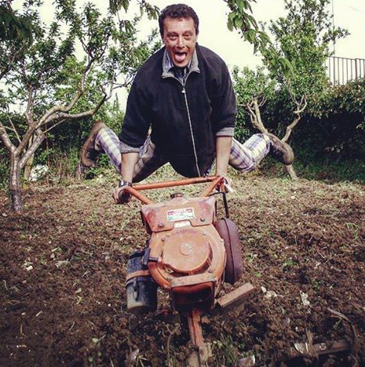

|REPLACE1|

.. _h7f754f4a3f606542a5e113c53275e5b:

Cirospat pro-file
*****************

\ |IMG1|\ 

.. admonition:: Reti

    \ |LINK1|\ , \ |LINK2|\ , \ |LINK3|\ 

In questo spazio descrivo le principali \ |STYLE0|\  in cui sono impegnato per ``lavoro`` e per ``passione civica``. Lo faccio per condividere conoscenza, credo che ci aiuta, tutti, a migliorare l'ambiente in cui operiamo. Descrivo tutte le attività lavorative in cui sono coinvolto tenendo traccia delle diverse iniziative avviate e dei risultati raggiunti.

Gli \ |STYLE1|\  principali di questo spazio sono: i ``dati`` che resi ``pubblici`` valorizzano il patrimonio informativo della Pubblica Amministrazione, l’ ``innovazione`` di ``processo`` e di ``servizio``, le ``competenze digitali`` dei dirigenti e dipendenti pubblici, la ``cultura digitale``.

Le iniziative di carattere \ |STYLE2|\ , vissute in spirito collaborativo insieme ad altre persone, contribuiscono a migliorare le competenze digitali utili nell'ambiente di lavoro al comune di Palermo.

.. admonition:: Questa visualizzazione è costruita

    su pagine di \ |STYLE3|\ , che grazie al plugin \ |LINK4|\  vengono pubblicate automaticamente in formato ``RST`` su un contenitore dentro \ |STYLE4|\ , che a sua volta espone direttamente sulla piattaforma \ |STYLE5|\ .

.. toctree::  
    :maxdepth: 1
    :caption: Contenuti

    social-profile
    work-profile
    cv-Ciro-Spataro
    tutorial
    mappe
    Ciro-Spataro-su-open-data-e-innovazione
    open-data-incontri-con-referenti-comunali
    servizi-digitali-comune-palermo
    webinar-opendata
    fondamentali

--------

|REPLACE2|

.. bottom of content

.. |STYLE0| replace:: **attività**

.. |STYLE1| replace:: **ambiti**

.. |STYLE2| replace:: **civico**

.. |STYLE3| replace:: **Google Doc**

.. |STYLE4| replace:: **Github**

.. |STYLE5| replace:: **Read the Docs**

.. |REPLACE1| raw:: html

    <a href="https://twitter.com/cirospat?ref_src=twsrc%5Etfw" class="twitter-follow-button" data-show-count="false">Follow @cirospat</a>
.. |REPLACE2| raw:: html

    
    
    

    
    <noscript>Please enable JavaScript to view the <a href="https://disqus.com/?ref_noscript">comments powered by Disqus.</a></noscript>

.. |LINK1| raw:: html

    <a href="http://opendatasicilia.it/" target="_blank">OpendataSicilia</a>

.. |LINK2| raw:: html

    <a href="https://forum.italia.it/" target="_blank">Forum sui servizi pubblici digitali “Developers Italia"</a>

.. |LINK3| raw:: html

    <a href="https://opendata.comune.palermo.it/" target="_blank">Comune di Palermo</a>

.. |LINK4| raw:: html

    <a href="http://googledocs.readthedocs.io" target="_blank">GGeditor</a>

