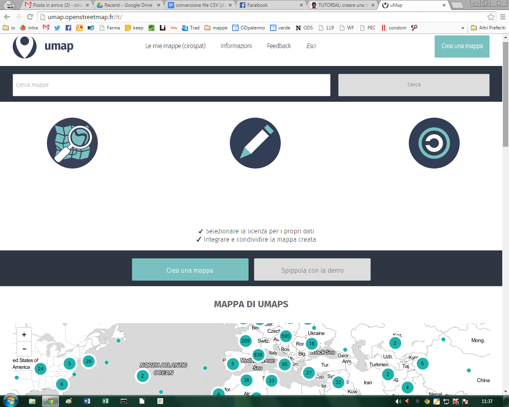
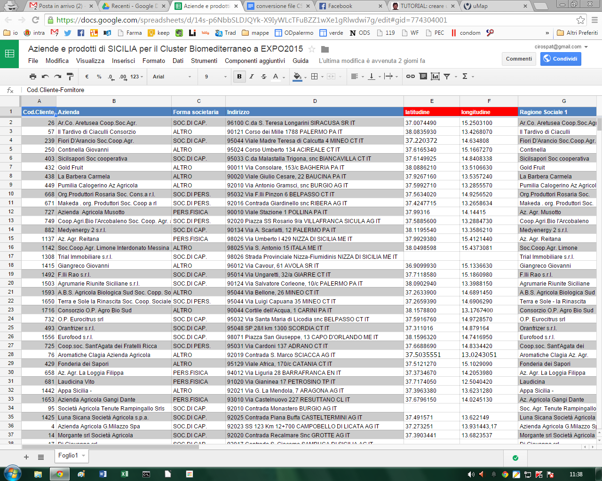
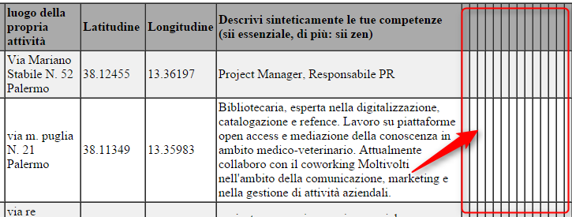
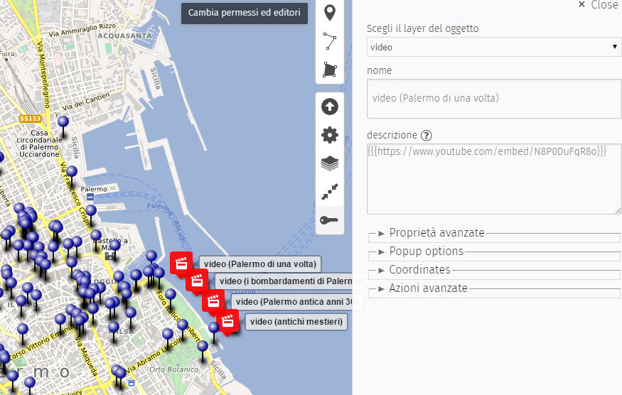

.. _h437e3f646f74e7862b524b642b621:

Tutorial per creare mappe online su \ |LINK1|\  aggiornabili con file CSV da \ |LINK2|\ 
########################################################################################

Lavoro per questo tutorial: Andrea Borruso che con la sua pazienza e generosità condivide tantissime nozioni su database e georeferenziazione per mappe online. (Scritto il febbraio del 2015)

\ |IMG1|\ 

Su UMAP si possono creare account per creare mappe, autenticandosi con il proprio profilo Tweetter o con quello di Github.

\ |IMG2|\ 

Ricordarsi di settare (da impostazioni) il foglio CSV di Google Drive come pubblico, in maniera tale che UMAP può accedere per leggere i dati delle celle.

Sempre da impostazioni settare "Regno Unito" per permettere alle celle di codificare latitudine e longitudine con il "." come separatore dei valori numerici.

Video tutorial \ |LINK3|\   per inserire tutti i campi di un foglio elettronico su Google Drive in una mappa uMap, senza fare query specifiche.

--------

Scrivere l'indirizzo in questa forma è il modo generale di accedere \ |LINK4|\ 

Sui fogli elettronici è possibile fare delle query (ricerche) via URL, inserendo dei parametri nell'URL stesso.

Questa è una chiamata generica al tuo foglio:

\ |LINK5|\ 

Ci sono diversi parametri, ma valorizzo solo key, che è l'identificativo del tuo foglio.

Se lo cambio in (in grassetto la modifica)

\ |LINK6|\ 

ottengo i "dati grezzi". 

Se imposto il formato di output li posso avere ad esempio in:

\ |STYLE0|\ 

\ |LINK7|\ 

\ |STYLE1|\ 

\ |LINK8|\ 

Se guardi l'output dell'html vedi che ci sono colonne in più.

\ |IMG3|\ 

Ma posso fare una query e scegliere quali colonne avere, usando un linguaggio SQL.

La struttura di una query  è questa:   

.. code:: 

    SELECT B,C,D,E,G,I,J 

B,C,D, ... sono la seconda, la terza e la quarta colonna. Gli sto dicendo di selezionare soltanto alcune colonne.

Devo mettere tutto in un URL:

.. code:: 

    https://spreadsheets.google.com/tq?tqx=out:html&tq=SELECT B,C,D,E,G,I,J&key=1b6txC5sG1WCR0MMTnPpaT6UnUv9mAwxni9Ds5SkHIEY

Vedrai che salta la prima colonna A e che non ci sono le ultime vuote.

Però voglio prendere le sole righe in cui è stata inserita la longitudine:

.. code:: 

    SELECT B,C,D,E,G,I,J WHERE I Contains '.'

Ovvero come prima ma DOVE la colonna "I" contiene il carattere "." (il separatore di decimale).

.. code:: 

    https://spreadsheets.google.com/tq?tqx=out:html&tq=SELECT B,C,D,E,G,I,J WHERE I Contains '.'&key=1b6txC5sG1WCR0MMTnPpaT6UnUv9mAwxni9Ds5SkHIEY

Questi ultimi due URL però contengono (nella query) caratteri strani ed è meglio codificarli, specie per farli parlare con app esterne come uMap.  E la query diventa:

.. code:: 

    SELECT%20B%2CC%2CD%2CE%2CG%2CI%2CJ%20WHERE%20I%20Contains%20%27.%27

"\ |STYLE2|\ " è il modo corretto di scrivere uno spazio.

"\ |STYLE3|\ " è la virgola.

Altre info sui caratteri qui: \ |LINK9|\ 

La documentazione ufficiale qui: \ |LINK10|\ 

La sintassi esatta (dicesi "encoding") può essere ottenuta anche utilizzando questo strumento online \ |LINK11|\  dove inseriamo 

.. code:: 

    SELECT B,C,D,E,G,I,J WHERE I Contains '.'

  

e cliccando su ENCODE otteniamo 

.. code:: 

    SELECT%20B%2CC%2CD%2CE%2CG%2CI%2CJ%20WHERE%20I%20Contains%20%27.%27

La query con colonna K (per mappa di pa/working):

* scritta in modo grezzo:

.. code:: 

    https://spreadsheets.google.com/tq?tqx=out:html&tq=SELECT B,C,D,E,G,I,J,K WHERE I Contains '.'&key=1b6txC5sG1WCR0MMTnPpaT6UnUv9mAwxni9Ds5SkHIEY

* scritta applicando la codifica dei caratteri: 

.. code:: 

    https://spreadsheets.google.com/tq?tqx=out:html&tq=SELECT%20B%2CC%2CD%2CE%2CG%2CI%2CJ%2CK%20WHERE%20I%20Contains%20%27.%27&key=1b6txC5sG1WCR0MMTnPpaT6UnUv9mAwxni9Ds5SkHIEY

* con output in CSV:

.. code:: 

    https://spreadsheets.google.com/tq?tqx=out:csv&tq=SELECT%20B%2CC%2CD%2CE%2CG%2CI%2CJ%2CK%20WHERE%20I%20Contains%20%27.%27&key=1b6txC5sG1WCR0MMTnPpaT6UnUv9mAwxni9Ds5SkHIEY

--------

.. _h304e30331b43475823127e112177f14:

Istruzioni per creare diversi layers sulla stessa mappa di UMAP avendo sempre come fonte lo stesso file CSV su GOOGLEDRIVE
==========================================================================================================================

Immagina di voler fare il layer agrumi, dallo stesso spreadsheet. Devi dirgli soltanto di aggiungere un parametro alla query.  Gli devi dire:

.. code:: 

    "SELECT A,B,C,D,E,F,G,H,I,L,M,N,O,P,Q,R,S WHERE E Contains '.' AND S Contains 'agrumi'"

Lo devi inserire nell'URL e fare l'encoding:

* questo l'esempio per farti vedere il risultato in HTML dei soli "agrumi"

.. code:: 

    https://spreadsheets.google.com/tq?tqx=out:html&tq=SELECT%20A%2CB%2CC%2CD%2CE%2CF%2CG%2CH%2CI%2CL%2CM%2CN%2CO%2CP%2CQ%2CR%2CS%20WHERE%20E%20Contains%20%27.%27%20AND%20S%20Contains%20%27agrumi%27&key=14s-p6NbbSLDJQYk-X9IyWLcTFuBZZ1wXe1gRlwdwi7g

 

* questo il CSV per il layer uMap

.. code:: 

    https://spreadsheets.google.com/tq?tqx=out:csv&tq=SELECT%20A%2CB%2CC%2CD%2CE%2CF%2CG%2CH%2CI%2CL%2CM%2CN%2CO%2CP%2CQ%2CR%2CS%20WHERE%20E%20Contains%20%27.%27%20AND%20S%20Contains%20%27agrumi%27&key=14s-p6NbbSLDJQYk-X9IyWLcTFuBZZ1wXe1gRlwdwi7g

   

questo URL alimenterà un singolo layer su UMAP quello di agrumi. Per altri layers relativi ad altri alimenti, basta seguire la stessa procedura avendo cura di scrivere nell'URL il nome preciso del campo (olio, vino, ecc).

E sotto le impostazioni da settare su UMAP alla voce "dati remoti":

\ |IMG4|\ 

\ |STYLE4|\ 

Dataset 2016 Incidenti stradali Palermo, QUERY per mappe uMap: 

\ |LINK12|\  

Thread su mailing list di opendatasicilia: \ |LINK13|\  

Fare la query usando le funzioni legate al tempo. Se vuoi ad esempio tutti gli incidenti del 2015 avvenuti dopo le 2:30 del 19 giugno, la query sarà: 

.. code:: 

    select A,B,C,D,E,F,G,H,I,J,K,L where L > datetime '2015-06-19 02:30:00'

e quindi query = 

.. code:: 

    http://spreadsheets.google.com/tq?tqx=out:csv&tq=select%20A%2CB%2CC%2CD%2CE%2CF%2CG%2CH%2CI%2CJ%2CK%2CL%20where%20L%20%3E%20datetime%20%272015-06-19%2002%3A30%3A00%27&key=1rpOadyp3npcOfJfFJbGjFNnLpJHF8q5fnxde_kMneMs 

\ |STYLE5|\  è:  

.. code:: 

    select A,B,C,D,E,F,G,H,I,J,K,L where I > timeofday '00:00:00' AND I < timeofday '07:00:00'

e quindi query =

.. code:: 

    http://spreadsheets.google.com/tq?tqx=out:csv&tq=select%20A%2CB%2CC%2CD%2CE%2CF%2CG%2CH%2CI%2CJ%2CK%2CL%20where%20I%20%3E%20timeofday%20%2700%3A00%3A00%27%20AND%20I%20%3C%20timeofday%20%2707%3A00%3A00%27%20&key=1rpOadyp3npcOfJfFJbGjFNnLpJHF8q5fnxde_kMneMs 

--------

.. _h4df4e4561665f5044b83dea4d59:

Formattazione testo su UMAP
===========================

* \*asterisco per l'italico\*

* \*\*due asterischi per il testo marcato\*\*

* # un cancelleto per l'intestazione principale

* ## due cancelletti per le intestazioni di secondo livello

* ### tre cancelletti per intestazione di terzo livello

* Link semplice: [[http://example.com]]

* Link con testo: [[http://example.com|testo del link]]

* Immagini: {{http://image.url.com}}

* Immagine con larghezza personalizza (in px): {{http://immagine.url.it|larghezza}}

* Iframe: {{{\ |LINK14|\ }}}        e per il video youtube = {{{http://www.youtube.com/embed/………..}}}

* Iframe with custom height (in px): {{{http://iframe.url.com|height}}}

* --- per una linea orizzontale

\ |IMG5|\ 

se vogliamo inserire un video dentro un punto della mappa (o anche nel db di GoogleDrive) nella figura quì sopra si vede il codice che dobbiamo inserire, praticamente dobbiamo scrivere: 

{{{https://www.youtube.com/embed/……….}}} 

dove i puntini stanno per l'indirizzo specifico del video di youtube. Se siamo nel database di GDrive lo dobbiamo scrivere dentro la cella.

--------

.. _h7e3d78703d3145c24171c565ed157a:

Mappathon del 25 giugno 2015 da PMO coworking via Principe di Belmonte
----------------------------------------------------------------------

Mappa che contiene tutte le info e gli strumenti utilizzati per realizzare i lavori fatti in comune:

\ |LINK15|\  

PAGINA FB = \ |LINK16|\  

ARTICOLO SULL'ESPERIENZA = \ |LINK17|\  

--------

.. _h7a626e4c591b79a74415d211931227f:

Tutorial: Guardian Datastore Explorer
=====================================

\ |LINK18|\  (di Andrea Borruso)

--------

.. _h62dc5f322383d4135d477f457b9:

Come inserire uno sfondo tiles personalizzato sulle mappe di UMAP
=================================================================

il video tutorial di Andrea Borruso è disponibile al link: \ |LINK19|\  

|REPLACE1|

--------

.. _h19412b2c2c21137d41633d46453117b:

Appunti vari:
=============

codice da tenere sempre presente come riferimento x generare mappe su UMAP

.. code:: 

    https://spreadsheets.google.com/tq?tqx=out:csv&tq=SELECT………………………..WHERE%20_%20Contains%20%27.%27&key=(e poi indirizzo specifico del foglio csv di googledrive)

\ |STYLE6|\ 

.. code:: 

    https://spreadsheets.google.com/tq?tqx=out:csv&tq=SELECT%20B%2CC%2CD%2CE%2CF%2CG%2CH%20WHERE%20G%20Contains%20%27.%27&key=1HJ5WTHwffADWEhg049umzbrJOaCV-qSXxDuWGMj-eXg

 

\ |STYLE7|\ 

.. code:: 

    https://spreadsheets.google.com/tq?tqx=out:csv&tq=SELECT%20A%2CB%2CC%2CD%2CE%2CF%2CG%2CH%2CI%2CL%2CM%2CN%2CO%2CP%2CQ%2CR%2CS%20WHERE%20E%20Contains%20%27.%27&key=14s-p6NbbSLDJQYk-X9IyWLcTFuBZZ1wXe1gRlwdwi7g

--------

.. _h59108023312347276643d5d482b4f2d:

Tutorial: creare mappe online con \ |LINK20|\   aggiornabili con file CSV da \ |LINK21|\ 
*****************************************************************************************

a cura di Ciro Spataro, che l'ha scoperto grazie a Maurizio Napolitano (NAPO) di Trento. A questo \ |LINK22|\  è possibile leggere il suo validissimo tutorial (di NAPO) sulla possibilità di creare mappe con UMAP utilizzando fotografie attraverso EtherCalc.

Andare su \ |LINK23|\  e premere "Create Spreadsheet"

\ |IMG6|\ 

(\ |STYLE8|\ )

si aprirà un foglio elettronico nuovo  con un indirizzo come per es. \ |LINK24|\  sul quale potere inserire dati.

Alla fine dell'inserimento di dati, andare su UMAP a Layer e nella sezione DATI REMOTI - URL inserire l'url generato da EtherCalc, quindi nel caso di prima, \ |LINK25|\  seguito da .csv quindi \ |LINK26|\ . 

Tutto qui, molto più semplice della procedura  da seguire per i fogli elettronici di Google Drive. Ma non c'è un sistema di protezione dei dati che si caricano nel foglio elettronico online di EtherCalc.

Un modo per proteggere i dati caricati nelle celle del foglio elettronico di EtherCalc è quello di mettere il lucchetto alle celle già compilate.

\ |IMG7|\ 

EtherCalc è un foglio elettronico comunque aperto a tutti gli editor, non ci sono funzioni per mettere altri utenti solo come visualizzatori e non editor, diversamente da come avviene nei fogli elettronici di GoogleDrive. 

Questa è un'informazione importante da conoscere prima di utilizzare EtherCalc per generare mappe in UMAP.

--------

|REPLACE2|

.. bottom of content

.. |STYLE0| replace:: **csv**

.. |STYLE1| replace:: **html**

.. |STYLE2| replace:: **%20**

.. |STYLE3| replace:: **%2C**

.. |STYLE4| replace:: **ricordarsi di settare formato "CSV", spuntare "richiesta proxy" e "dinamico"**

.. |STYLE5| replace:: **La query per tutti gli incidenti tra le 00:00:00 e le 07:00:00**

.. |STYLE6| replace:: **url x UMAP mappa uffici comunali:**

.. |STYLE7| replace:: **url x UMAP mappa aziende partecipanti al bio cluster mediterraneo di expo2015:**

.. |STYLE8| replace:: *nota: non c'è bisogno di creare account per generare un dataset su EtherCalc*

.. |REPLACE1| raw:: html

    <iframe width="100%" height="380" src="https://www.youtube.com/embed/FeUayR8t8oM" frameborder="0" allow="autoplay; encrypted-media" allowfullscreen></iframe>
.. |REPLACE2| raw:: html

    
    
    

    
    <noscript>Please enable JavaScript to view the <a href="https://disqus.com/?ref_noscript">comments powered by Disqus.</a></noscript>

.. |LINK1| raw:: html

    <a href="http://umap.openstreetmap.fr/it/" target="_blank">UMAP</a>

.. |LINK2| raw:: html

    <a href="https://drive.google.com/drive" target="_blank">GOOGLEDRIVE</a>

.. |LINK3| raw:: html

    <a href="https://www.youtube.com/watch?v=YKZc84WtTd4" target="_blank">https://www.youtube.com/watch?v=YKZc84WtTd4</a>

.. |LINK4| raw:: html

    <a href="https://spreadsheets.google.com/" target="_blank">https://spreadsheets.google.com/</a>

.. |LINK5| raw:: html

    <a href="https://spreadsheets.google.com/?tqx=&tq=&key=1b6txC5sG1WCR0MMTnPpaT6UnUv9mAwxni9Ds5SkHIEY" target="_blank">https://spreadsheets.google.com/?tqx=&tq=&key=1b6txC5sG1WCR0MMTnPpaT6UnUv9mAwxni9Ds5SkHIEY</a>

.. |LINK6| raw:: html

    <a href="https://spreadsheets.google.com/tq?tqx=&tq=&key=1b6txC5sG1WCR0MMTnPpaT6UnUv9mAwxni9Ds5SkHIEY" target="_blank">https://spreadsheets.google.com/tq?tqx=&tq=&key=1b6txC5sG1WCR0MMTnPpaT6UnUv9mAwxni9Ds5SkHIEY</a>

.. |LINK7| raw:: html

    <a href="https://spreadsheets.google.com/tq?tqx=out:html&tq=&key=1b6txC5sG1WCR0MMTnPpaT6UnUv9mAwxni9Ds5SkHIEY" target="_blank">https://spreadsheets.google.com/tq?tqx=out:csv&tq=&key=1b6txC5sG1WCR0MMTnPpaT6UnUv9mAwxni9Ds5SkHIEY</a>

.. |LINK8| raw:: html

    <a href="https://spreadsheets.google.com/tq?tqx=out:html&tq=&key=1b6txC5sG1WCR0MMTnPpaT6UnUv9mAwxni9Ds5SkHIEY" target="_blank">https://spreadsheets.google.com/tq?tqx=out:html&tq=&key=1b6txC5sG1WCR0MMTnPpaT6UnUv9mAwxni9Ds5SkHIEY</a>

.. |LINK9| raw:: html

    <a href="http://www.w3schools.com/tags/ref_urlencode.asp" target="_blank">http://www.w3schools.com/tags/ref_urlencode.asp</a>

.. |LINK10| raw:: html

    <a href="https://developers.google.com/chart/interactive/docs/querylanguage" target="_blank">https://developers.google.com/chart/interactive/docs/querylanguage</a>

.. |LINK11| raw:: html

    <a href="http://meyerweb.com/eric/tools/dencoder/" target="_blank">http://meyerweb.com/eric/tools/dencoder/</a>

.. |LINK12| raw:: html

    <a href="https://docs.google.com/spreadsheets/d/1rpOadyp3npcOfJfFJbGjFNnLpJHF8q5fnxde_kMneMs" target="_blank">https://docs.google.com/spreadsheets/d/1rpOadyp3npcOfJfFJbGjFNnLpJHF8q5fnxde_kMneMs</a>

.. |LINK13| raw:: html

    <a href="https://groups.google.com/forum/#!topic/opendatasicilia/X0BDsSNBlq8" target="_blank">https://groups.google.com/forum/#!topic/opendatasicilia/X0BDsSNBlq8</a>

.. |LINK14| raw:: html

    <a href="http://iframe.url.com" target="_blank">http://iframe.url.com</a>

.. |LINK15| raw:: html

    <a href="http://umap.openstreetmap.fr/it/map/esercitazione-per-mappathon-palermo-25-giugno-2015_45262" target="_blank">http://umap.openstreetmap.fr/it/map/esercitazione-per-mappathon-palermo-25-giugno-2015_45262</a>

.. |LINK16| raw:: html

    <a href="https://www.facebook.com/events/1589763317955627/" target="_blank">https://www.facebook.com/events/1589763317955627/</a>

.. |LINK17| raw:: html

    <a href="http://opendatasicilia.it/2015/06/26/il-1-mappathon-pubblico-a-palermo-25-06-2015-pmocoworking/" target="_blank">http://opendatasicilia.it/2015/06/26/il-1-mappathon-pubblico-a-palermo-25-06-2015-pmocoworking/</a>

.. |LINK18| raw:: html

    <a href="http://school.dataninja.it/unit/guardian-datastore-explorer-per-costruire-query-su-fogli-elettronici-google-drive/" target="_blank">Per costruire query su fogli elettronici Google Drive</a>

.. |LINK19| raw:: html

    <a href="https://www.youtube.com/watch?v=FeUayR8t8oM&feature=youtu.be&hd=1" target="_blank">https://www.youtube.com/watch?v=FeUayR8t8oM&feature=youtu.be&hd=1</a>

.. |LINK20| raw:: html

    <a href="http://umap.openstreetmap.fr/it/" target="_blank">UMAP</a>

.. |LINK21| raw:: html

    <a href="https://ethercalc.org" target="_blank">EtherCalc</a>

.. |LINK22| raw:: html

    <a href="http://de.straba.us/2015/05/22/tutorial-creare-una-mappa-online-con-fotografie-in-umap-aggiornabile-con-ethercalc/" target="_blank">link</a>

.. |LINK23| raw:: html

    <a href="https://ethercalc.org/" target="_blank">https://ethercalc.org/</a>

.. |LINK24| raw:: html

    <a href="https://ethercalc.org/78ljkaxjtw" target="_blank">https://ethercalc.org/78ljkaxjtw</a>

.. |LINK25| raw:: html

    <a href="https://ethercalc.org/78ljkaxjtw" target="_blank">https://ethercalc.org/78ljkaxjtw</a>

.. |LINK26| raw:: html

    <a href="https://ethercalc.org/78ljkaxjtw.csv" target="_blank">https://ethercalc.org/78ljkaxjtw.csv</a>

.. |IMG4| image:: static/tutorial-googledrive-to-umap_4.png
   :height: 469 px
   :width: 222 px

.. |IMG7| image:: static/tutorial-googledrive-to-umap_7.png
   :height: 225 px
   :width: 652 px
